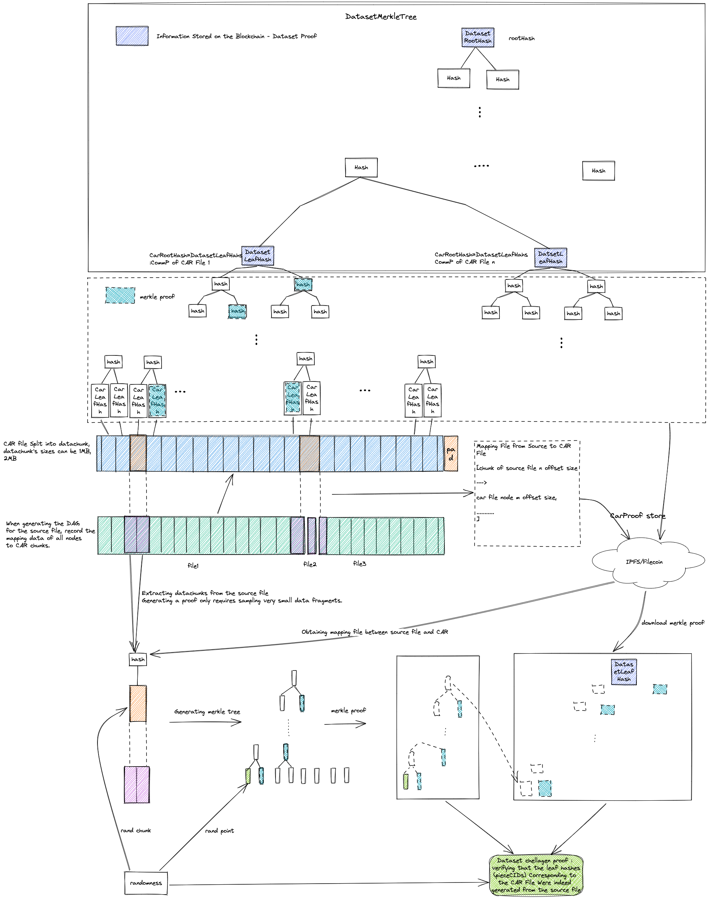
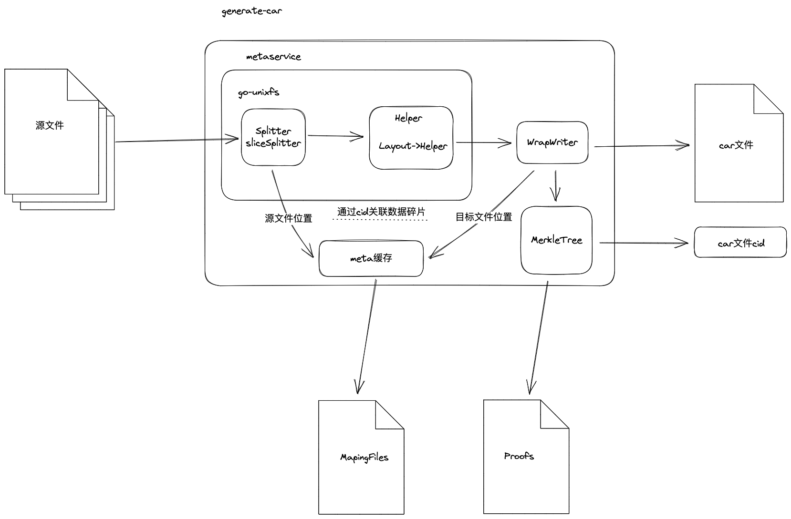

# Algorithm Design

## 1 Objectives
The objective is to propose a dataset consistency verification algorithm that empowers efficient data storage, supporting trustless notary by:
- Enabling proof and verification of valid data storage.
- Monitoring customer's valid data storage and verification at a finer granularity.
- Reducing the complexity of notory work through code.
- Decoupling datacap and notary signatures to prevent malicious behavior.

## 2 Dataset Consistency Algorithm
### 2.1 Introduction
Based on the dataset consistency algorithm, it is possible to prove the consistency between the original dataset and the dataset stored on Filecoin. It is known that the storage data of Filecoin transactions is in the form of CAR files. The storage of each dataset on Filecoin is ultimately represented by a series of completed CAR file storage.

#### 2.1.1 glossary
**CarLeafHash**

>The dataset consistency algorithm splits each car file into multiple data fragments (such as 1M\2M). The hash value of each data fragment is referred to as CarLeafHash.

**CarRootHash** and **CarMerkleTree**

>The CarRootHash of a car file can be obtained by constructing a CarMerkleTree using all the CarLeafHashes in the car file. The CarMerkleTree is stored on the Filecoin network (off-chain).

**DatasetLeafHash**:

>The CarRootHash (pieceCid) of a car file is equivalent to the DatasetLeafHash.

**DatasetRootHash** and **DatasetMerkleTree**:

>The DatasetRootHash of dataset can be obtained by constructing a DatasetMerkleTree using all the DatasetLeafHash(CarRootHash). The DatasetMerkleTree is stored on-chain. 

**MappingFiles**

>The file that contains the mapping relationship between each Car and the source files that constitute it, including the Car-to-source file mapping and the source file-to-Car mapping, is called MappingFiles The MappingFiles is stored on the Filecoin network (off-chain).

**CarProof**

>CarProofs are composed of CarMerkleTree and MappingFiles.TheCarProof is stored on the Filecoin network (off-chain) .

**DatasetProof**

>DatasetProof consists of a DatasetMerkleTree and CarProofs corresponding to all DatasetLeafHashes(CarRootHash). The DatasetMerkleTree is stored on-chain, while the CarProofs are stored on the Filecoin network (off-chain) .


### 2.2 Principles
- The DP needs to submit the DatasetProof to the dataset contract, where the DatasetMerkleTree is stored on-chain, and the CarProofs are stored on the Filecoin network (to save on-chain resources).
- The DA challenges specific DatasetLeafHashes (CarRootHashes) and CarLeafHashes through random challenges.
- The DA downloads partial file data of the CarProofs corresponding to the challenged CarRootHashes and CarLeafHashes from the Filecoin network (meeting the proof requirements, typically in the MB-level).
- The DA submits the challenged DatasetHash Merkle Proof and CarRootHash Merkle Proof to the blockchain as challenge proof information for verification.
- Through multi-point challenges and multiple participants' challenges, random challenges are performed on multiple Car files to ensure the correctness of the entire dataset.
- Due to this algorithm, the system can allocate DataCap at the granularity of individual car files for automatic distribution and management.



## 3 Dataset Consistency Proof and Verification Toolset

The Dataset Consistency Proof and Verification Toolset is designed to implement the dataset consistency proof algorithm. It includes functionalities for generating dataset proofs, sampling source data, and verification tools.

### 3.1 CAR Generation Tool
Based on Singularity, the following features can be added:
- DatasetMerkleTree of DatasetProof (On-chain)
- CarProofs(MappingFiles and CarMerkleTree) of DatasetProof(Off-chain,stored on IPFS/filecoin) 
- Dataset Original File Scanning Strategy (including CAR file size configuration)
- Ensuring that CarRootHash can be converted to PieceCID without requiring PadCommP

Reference Tools:
- Singularity: A tool for generating CAR files.
- boost (reference project): A project that can be used as a reference for validation.
- Dependencies: go-unixfs, go-car, go-unixfsnode.

The CAR generation tool can be extended by modifying go-unixfs, go-ipfs-chunker, and the Writer component. These modifications can be implemented by extending the functionality of the generate-car tool.
The MerkleTree component can be implemented using the go-merkletree library (https://github.com/txaty/go-merkletree) to generate commP (Piece Commitment) and consistency proofs.

Principles as belows:



#### 3.1.1 Source File Scanning Strategy
// TODO: Build a source file scanning strategy to ensure that the same dataset proof can be generated from the same source file.

- Normalize the file download from the data source to the local environment.
- Map the source data to the car file, controlling the generation of a single car file (including its source data download).

#### 3.1.2 Mapping File Generation
The generation of the mapping file is based on modifications to generate-car, without affecting the original functionality of generate-car. It adds the saving of the mapping file.

##### 3.1.2.1 go-unixfs Secondary Development Design
Define the Helper interface.

```
type Helper interface {
	Done() bool
	Next() ([]byte, error)
	GetDagServ() ipld.DAGService
	GetCidBuilder() cid.Builder
	NewLeafNode(data []byte, fsNodeType pb.Data_DataType) (ipld.Node, error)
	FillNodeLayer(node *FSNodeOverDag) error
	NewLeafDataNode(fsNodeType pb.Data_DataType) (node ipld.Node, dataSize uint64, err error)
	ProcessFileStore(node ipld.Node, dataSize uint64) ipld.Node
	Add(node ipld.Node) error
	Maxlinks() int
	NewFSNodeOverDag(fsNodeType pb.Data_DataType) *FSNodeOverDag
	NewFSNFromDag(nd *dag.ProtoNode) (*FSNodeOverDag, error)
}

```

Implement the Helper interface and encapsulate NewLeafDataNode to record the source file information when constructing the node.

Define an instance of the Helper interface:

```
// Helper callback function that passes back the node CID and node type when constructing the car file node
type HelperAction func(node ipld.Node, nodeType pb.Data_DataType)

// Helper interface instance
type WrapDagBuilder struct {
	db  *ihelper.DagBuilderHelper  //original Helper
	hcb HelperAction // helper callback function
}

```
Modify the Layout and fillNodeRec to use the Helper interface for car file DAG layout. The method for generating the layout of the car file remains unchanged, and the Helper callback is called when adding nodes to the DAG to pass back the CID and node type.

[go-unixfs](https://github.com/ipfs/go-unixfs) Layout Strategy:
```
//	       +-------------+
//	       |   Root 1    |
//	       +-------------+
//	              |
//	 ( fillNodeRec fills in the )
//	 ( chunks on the root.      )
//	              |
//	       +------+------+
//	       |             |
//	  + - - - - +   + - - - - +
//	  | Chunk 1 |   | Chunk 2 |
//	  + - - - - +   + - - - - +
//
//	                     ↓
//	When the root is full but there's more data...
//	                     ↓
//
//	       +-------------+
//	       |   Root 1    |
//	       +-------------+
//	              |
//	       +------+------+
//	       |             |
//	  +=========+   +=========+   + - - - - +
//	  | Chunk 1 |   | Chunk 2 |   | Chunk 3 |
//	  +=========+   +=========+   + - - - - +
//
//	                     ↓
//	...Layout's job is to create a new root.
//	                     ↓
//
//	                      +-------------+
//	                      |   Root 2    |
//	                      +-------------+
//	                            |
//	              +-------------+ - - - - - - - - +
//	              |                               |
//	       +-------------+            ( fillNodeRec creates the )
//	       |   Node 1    |            ( branch that connects    )
//	       +-------------+            ( "Root 2" to "Chunk 3."  )
//	              |                               |
//	       +------+------+             + - - - - -+
//	       |             |             |
//	  +=========+   +=========+   + - - - - +
//	  | Chunk 1 |   | Chunk 2 |   | Chunk 3 |
//	  +=========+   +=========+   + - - - - +

```

##### go-ipfs-chunker Secondary Development Design

This package is used to split the original data to construct the DAG. By default, it uses SizeSplitter to create data blocks of equal size. We will modify SizeSplitter to pass back the source file information while splitting the data blocks.

Define the splitter:
```
type sliceSplitter struct {
	r       io.Reader     // Data source
	size    uint32        // Size of data blocks for splitting
	err     error

	srcPath string        // Record the original file path
	cb      SplitterAction // Allow external callback function to receive original file read information
	offset  uint64        // Record the current file read offset
}
```

Define the splitter callback function, which is used for the metaservice to receive the source file data:
```
type SplitterAction func(srcPath string, offset uint64, size uint32, eof bool)
```
Implement the Splitter interface and use SplitterAction to output the source file splitting information:
```
type Splitter interface {
	Reader() io.Reader
	NextBytes() ([]byte, error) // Encapsulate the call to SplitterAction to collect source data information
	Bytes(start, offset int) ([]byte, error)
}
```

##### 3.1.2.3 metaservice Design
The metaservice tracks the association between node source data and car file nodes using node CIDs

```
// ChunkMeta defines the chunk metadata
type ChunkMeta struct {
	SrcPath   string           `json:"srcpath"`    // Path to the source file that the chunk is collected from
	SrcOffset uint64           `json:"srcoffset"`  // Offset of the chunk data within the source file
	Size      uint32           `json:"size"`       // Size of the chunk data
	DstPath   string           `json:"dstpath"`    // Path to the car file that the chunk belongs to
	DstOffset uint64           `json:"dstoffset"`  // Offset of the chunk within the target car file
	NodeType  pb.Data_DataType `json:"nodetype"`   // Node type
	Cid       cid.Cid          `json:"cid"`        // Node CID
	Links     []*ipld.Link           `json:"links"` // Chunks of the node, i.e., child nodes
}

// GetDstRange returns the start and end positions of a chunk within the target car file
func (cm *ChunkMeta) GetDstRange(c cid.Cid) (uint64, uint64)

// SrcData defines the source data information
type SrcData struct {
	Path   string
	Offset uint64
	Size   uint32
}
```

```
// MetaService definition
type MetaService struct {
	spl    chunker.Splitter // Splitter
	writer io.Writer        // Target car file writer
	helper ihelper.Helper   // Helper

	metas map[cid.Cid]*types.ChunkMeta // Source data list
	lk    sync.Mutex

	splCh chan *types.SrcData // Channel for passing back source data information

	calc  *commp.Calc             // commp calculator
	hashs map[uint]map[int][]byte // Layer -> Node index -> Hash
	hlk   sync.Mutex
}

// Target writer wrapper
// Write After Action
type WriteAfterAction func(path string, cid cid.Cid, count int, offset uint64)

// Write Before Action
type WriteBeforeAction func([]byte, io.Writer) ([]byte, error)

// Writer wrapper
type WrapWriter struct {
	io.Writer                 // Target car writer
	path     string           // Target car path
	offset   uint64           // Current write offset
	after    WriteAfterAction // Action handler after car writing
	before   WriteBeforeAction // Action handler before car writing
}

// Override the Write method in func (bc *WrapWriter) Write(p []byte) (int, error) to record the write information and implement a custom Writer
```

##### 3.1.2.4 generate-car Secondary Development Design

### 3.2 Proof Challenge Algorithm
#### 3.2.1 Source File Proof Challenge
- Generating Merkle proofs from source data fragments (+ Mappingfile + CarMerkleTree)

### 3.2.2 Car File Proof Challenge
- Generating Merkle proofs from car file fragments (+ Mappingfile + CarMerkleTree)

### 3.3 Verification
#### 3.3.1 On-chain Verification Algorithm for Consistency Proof
- Correctness verification of Merkle proofs

#### 3.3.2 General Verification Algorithm for Consistency Proof
- Correctness verification of Merkle proofs

### 3.4 Random Sampling Algorithm
- Random challenge for car files
- Random challenge points for source files
- Referring to Filecoin's random challenge algorithm

### 3.5 Source Data Sampling Tool
- Sampling and downloading of generic source data fragments (AWS/S3/HTTP)