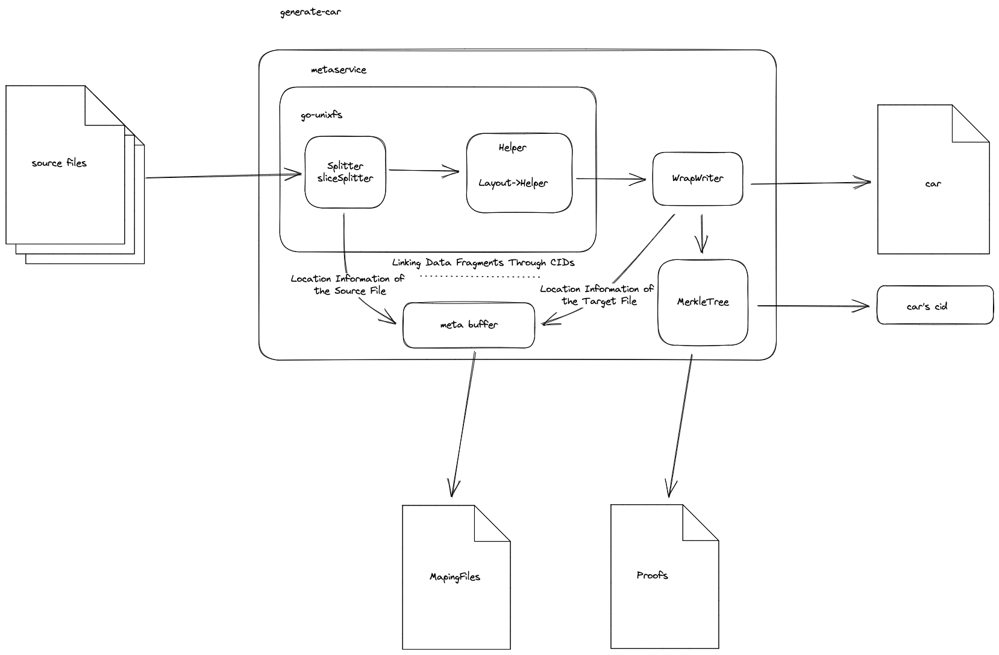

# Algorithm Design

## 1 Objectives
The objective is to propose a dataset consistency verification algorithm that empowers efficient data storage, supporting trustless notary by:
- Enabling proof and verification of valid data storage.
- Monitoring customer's valid data storage and verification at a finer granularity.
- Reducing the complexity of notory work through code.
- Decoupling datacap and notary signatures to prevent malicious behavior.

## 2 Dataset Consistency Algorithm
### 2.1 介绍
Based on the dataset consistency algorithm, it is possible to prove the consistency between the original dataset and the dataset stored on Filecoin. It is known that the storage data of Filecoin transactions is in the form of CAR files. The storage of each dataset on Filecoin is ultimately represented by a series of completed CAR file storage.

#### 2.1.1 术语
**CarLeafHash**

>The dataset consistency algorithm splits each car file into multiple data fragments (such as 1M\2M). The hash value of each data fragment is referred to as CarLeafHash.

**CarRootHash** and **CarMerkleTree**

>The CarRootHash of a car file can be obtained by constructing a CarMerkleTree using all the CarLeafHashes in the car file. The CarMerkleTree is stored on the Filecoin network (off-chain).

**DatasetLeafHash**:

>The CarRootHash (pieceCid) of a car file is equivalent to the DatasetLeafHash.

**DatasetRootHash** and **DatasetMerkleTree**:

>The DatasetRootHash of dataset can be obtained by constructing a DatasetMerkleTree using all the DatasetLeafHash(CarRootHash). The DatasetMerkleTree is stored on-chain. 

**MappingFiles**

>The file that contains the mapping relationship between each Car and the source files that constitute it, including the Car-to-source file mapping and the source file-to-Car mapping, is called MappingFiles The MappingFiles is stored on the Filecoin network (off-chain).

**CarProof**

>CarProofs are composed of CarMerkleTree and MappingFiles.TheCarProof is stored on the Filecoin network (off-chain) .

**DatasetProof**

>DatasetProof consists of a DatasetMerkleTree and CarProofs corresponding to all DatasetLeafHashes(CarRootHash). The DatasetMerkleTree is stored on-chain, while the CarProofs are stored on the Filecoin network (off-chain) .


### 2.2 Principles
- The DP needs to submit the DatasetProof to the business contract, where the DatasetMerkleTree is stored on-chain, and the CarProofs are stored on the Filecoin network (to save on-chain resources).
- The DA challenges specific DatasetLeafHashes (CarRootHashes) and CarLeafHashes through random challenges.
- The DA downloads partial file data of the CarProofs corresponding to the challenged CarRootHashes and CarLeafHashes from the Filecoin network (meeting the proof requirements, typically in the MB-level).
- The DA submits the challenged DatasetHash Merkle Proof and CarRootHash Merkle Proof to the blockchain as challenge proof information for verification.
- Through multi-point challenges and multiple participants' challenges, random challenges are performed on multiple Car files to ensure the correctness of the entire dataset.
- Due to this algorithm, the system can allocate DataCap at the granularity of individual car files for automatic distribution and management.


## 3 Dataset Consistency Proof and Verification Toolset

一致性证明工具集用于实现一致性证明算法，包括数据集证明的生成、源数据采样、校验工具


### 3.1 car生成工具
增加如下功能
    - 基于singularity改造
    - 数据集证明信息（上链）
    - 源文件与car的映射关系
    - 缓存树（car文件的merkle树,filecoin/ipfs存储）
	- 数据集原始文件扫描策略(含car文件大小配置)

参考工具：singularity(generate-car)、boost（验证参考项目）、依赖go-unixfs、go-car、go-unixfsnode

car生成工具通过对go-unixfs、go-ipfs-chunker、以及对Writer的改造，通过对generate-car扩展实现功能
MerkleTree 通过[go-merkletree](https://github.com/txaty/go-merkletree)实现commP以及一致性证明的生成

原理如下:



#### 3.1.1 源文件扫描策略
// TODO: 构建源文件扫描策略使同一份源文件能够输出相同的数据集证明
- 从数据源到本地的文件规范化下载
- 从源数据到car文件映射信息，控制到单个car的生成(包含其源数据下载)


#### 3.1.2 映射文件生成
映射文件生成基于对[generate-car](https://github.com/tech-greedy/generate-car)的改造完成，不影响generate-car原有功能，增加映射文件的保存

##### 3.1.2.1 go-unixfs二次开发设计
定义Helper接口

```
type Helper interface {
	Done() bool
	Next() ([]byte, error)
	GetDagServ() ipld.DAGService
	GetCidBuilder() cid.Builder
	NewLeafNode(data []byte, fsNodeType pb.Data_DataType) (ipld.Node, error)
	FillNodeLayer(node *FSNodeOverDag) error
	NewLeafDataNode(fsNodeType pb.Data_DataType) (node ipld.Node, dataSize uint64, err error)
	ProcessFileStore(node ipld.Node, dataSize uint64) ipld.Node
	Add(node ipld.Node) error
	Maxlinks() int
	NewFSNodeOverDag(fsNodeType pb.Data_DataType) *FSNodeOverDag
	NewFSNFromDag(nd *dag.ProtoNode) (*FSNodeOverDag, error)
}

```

实现Helper接口并对NewLeafDataNode重新封装，记录源数据构造node的源文件信息
定义Helper接口实例

```
// Helper回调函数,构造car文件node时将node cid及node类型回传
type HelperAction func(node ipld.Node, nodeType pb.Data_DataType)

// Helper接口实例
type WrapDagBuilder struct {
	db  *ihelper.DagBuilderHelper  //原Helper
	hcb HelperAction //helper回调函数
}

```

改造Layout和fillNodeRec采用Helper接口实现car文件dag布局,car文件的生成布局方法不改动，只在node加入dag时调用Helper回调将cid和节点类型传回

[go-unixfs](https://github.com/ipfs/go-unixfs)中关于Layout策略如下:
```
//	       +-------------+
//	       |   Root 1    |
//	       +-------------+
//	              |
//	 ( fillNodeRec fills in the )
//	 ( chunks on the root.      )
//	              |
//	       +------+------+
//	       |             |
//	  + - - - - +   + - - - - +
//	  | Chunk 1 |   | Chunk 2 |
//	  + - - - - +   + - - - - +
//
//	                     ↓
//	When the root is full but there's more data...
//	                     ↓
//
//	       +-------------+
//	       |   Root 1    |
//	       +-------------+
//	              |
//	       +------+------+
//	       |             |
//	  +=========+   +=========+   + - - - - +
//	  | Chunk 1 |   | Chunk 2 |   | Chunk 3 |
//	  +=========+   +=========+   + - - - - +
//
//	                     ↓
//	...Layout's job is to create a new root.
//	                     ↓
//
//	                      +-------------+
//	                      |   Root 2    |
//	                      +-------------+
//	                            |
//	              +-------------+ - - - - - - - - +
//	              |                               |
//	       +-------------+            ( fillNodeRec creates the )
//	       |   Node 1    |            ( branch that connects    )
//	       +-------------+            ( "Root 2" to "Chunk 3."  )
//	              |                               |
//	       +------+------+             + - - - - -+
//	       |             |             |
//	  +=========+   +=========+   + - - - - +
//	  | Chunk 1 |   | Chunk 2 |   | Chunk 3 |
//	  +=========+   +=========+   + - - - - +

```

##### 3.1.2.2 go-ipfs-chunker二次开发设计

该包用于将原数据切分以构建dag，默认采用SizeSpliter将源数据按大小相等创建数据块，基于SizeSplider进行改造，在切分数据块时将源文件信息传回
定义splitter
```
type sliceSplitter struct {
	r    io.Reader     // 数据源
	size uint32        // 数据块切分的大小
	err  error

	srcPath string     // 记录原文件路径
	cb SplitterAction  // 允许外部传入回调函数获取原始文件读取信息
	offset uint64      // 记录当前文件读取offset
}
```

定义splitter回调函数,用于metaservice接受源文件数据
```
type SplitterAction func(srcPath string, offset uint64, size uint32, eof bool)
```
实现Splitter接口并通过SplitterAction实现源文件拆分信息的输出
```
type Splitter interface {
	Reader() io.Reader
	NextBytes() ([]byte, error) //封装对SplitterAction的调用实现源数据信息的采集
	Bytes(start, offset int) ([]byte, error)
}
```

##### 3.1.2.3 metasevice设计
metaservice以node cid追踪node源数据和car文件node之间的关联

```
//chunk meta数据定义
type ChunkMeta struct {
	SrcPath   string           `json:"srcpath"`    //该chunk 采集源文件的路径
	SrcOffset uint64           `json:"srcoffset"`  //该chunk data所在的源文件偏移
	Size      uint32           `json:"size"`       //该chunk data大小
	DstPath   string           `json:"dstpath"`    //该chunk所在的car文件路径
	DstOffset uint64           `json:"dstoffset"`  //该chunk在目标car中偏移
	NodeType  pb.Data_DataType `json:"nodetype"`   //node类型
	Cid       cid.Cid          `json:"cid"`        //node cid
	Links     []*ipld.Link           `json:links`  // node的chunk,即子node
}

//获取一个chunk在目标car中的start和结束位置
func (cm *ChunkMeta) GetDstRange(c cid.Cid) (uint64, uint64)

//定义源数据信息
type SrcData struct {
	Path   string
	Offset uint64
	Size   uint32
}
```

```
// MetaService定义
type MetaService struct {
	spl    chunker.Splitter //Splitter
	writer io.Writer        //目标car文件writer
	helper ihelper.Helper   //Helper

	metas map[cid.Cid]*types.ChunkMeta  //源数据列表
	lk    sync.Mutex

	splCh chan *types.SrcData           //用于回传源数据信息

	calc          *commp.Calc           //commp计算器
	hashs         map[uint]map[int][]byte   //层数->节点序号->hash
	hlk           sync.Mutex
}


//目标writer封装
//写入后Action
type WriteAfterAction func(path string, cid cid.Cid, count int, offset uint64)

//写入前Action
type WriteBeforeAction func([]byte, io.Writer) ([]byte, error)

//writer封装
type WrapWriter struct {
	io.Writer                   //目标car writer
	path   string               //目标car path
	offset uint64               //当前的写入offset
	after  WriteAfterAction     //car写入后Action 句柄
	before WriteBeforeAction    //car写入前Action 句柄
}

重写func (bc *WrapWriter) Write(p []byte) (int, error) 记录写入信息，重新实现 Writer
```


##### 3.1.2.4 generate-car二次开发设计


### 3.2 证明挑战算法

#### 3.2.1 源文件证明挑战
	- 源数据碎片(+映射文件+缓存树)到merkle证明的生成

#### 3.2.2 car文件证明挑战
	- car文件碎片(+映射文件+缓存树)到merkle证明的生成

### 3.3 校验

#### 3.3.1 一致性证明的链上校验算法
	- merkle证明的正确性校验 

#### 3.3.2 一致性证明的通用校验算法
	- merkle证明的正确性校验 

### 3.4 随机抽样算法
	- car文件的随机挑战
	- 源文件随机挑战点

参考filecoin的随机挑战算法

### 3.5 源数据采样工具
	- 通用源（aws\s3\http）数据碎片采样、下载%