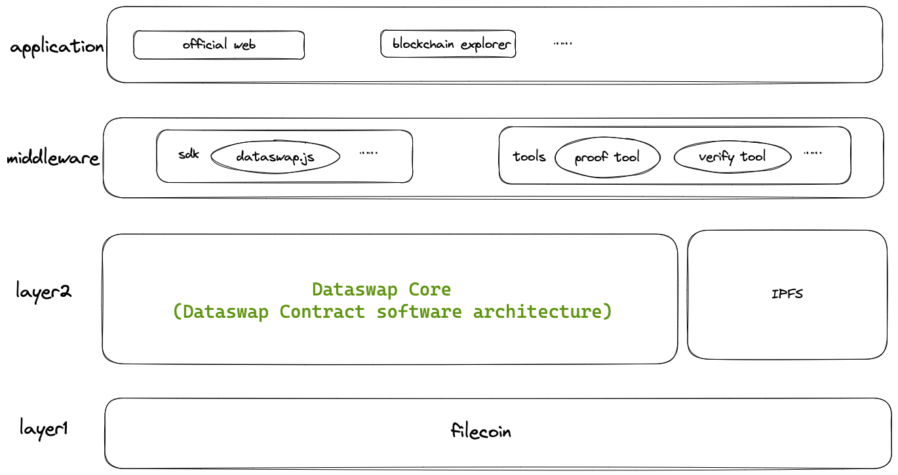

# 1. Introduction
## 1.1 Features

- Utilizing a data authentication mechanism (including data submit, verification, and auditing) to ensure the genuine value of platform data.

- Leveraging blockchain technology for permanent storage (using Filecoin) and distribution of datasets, establishing a transparent and publicly accessible distributed data index.

- Offering open retrieval and download services, enabling users to effortlessly search for and obtain the datasets they need. This encompasses diverse access methods, such as web interfaces, API integrations, and file downloads.

- Providing decentralized data analysis and matching services, empowering data-driven decision-making and intelligent solutions.

- Aggregating open big data from various global regions and industries, encompassing economic, financial, medical, and health data types. This creates efficient and valuable gateways to datasets.

- Implementing a decentralized matching mechanism to attract more suppliers of open datasets, storage providers, and users, fostering worldwide data sharing and innovation.

## 1.2 Architecture Diagrams

### 1.2.1 Layered Architecture Diagram

Layer2 meets the requirements of [Ideation: Trustless Notary Design Space + Guidelines](https://medium.com/filecoin-plus/ideation-trustless-notary-design-space-guidelines-bc21f6d9d5f2)

### 1.2.2 Data Lifecycle Diagram

## 1.3 Key Concepts