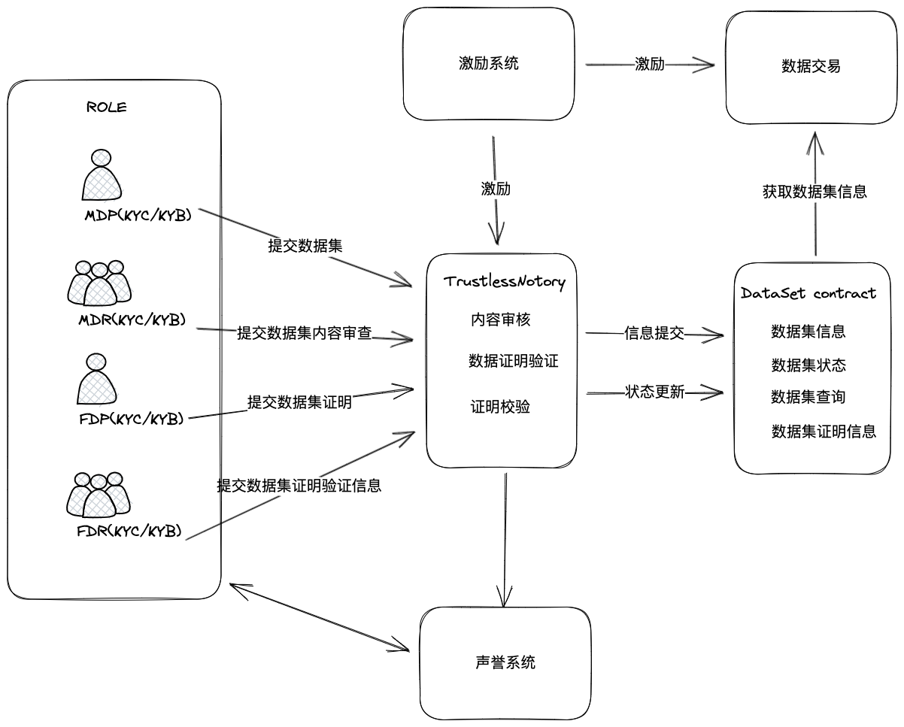
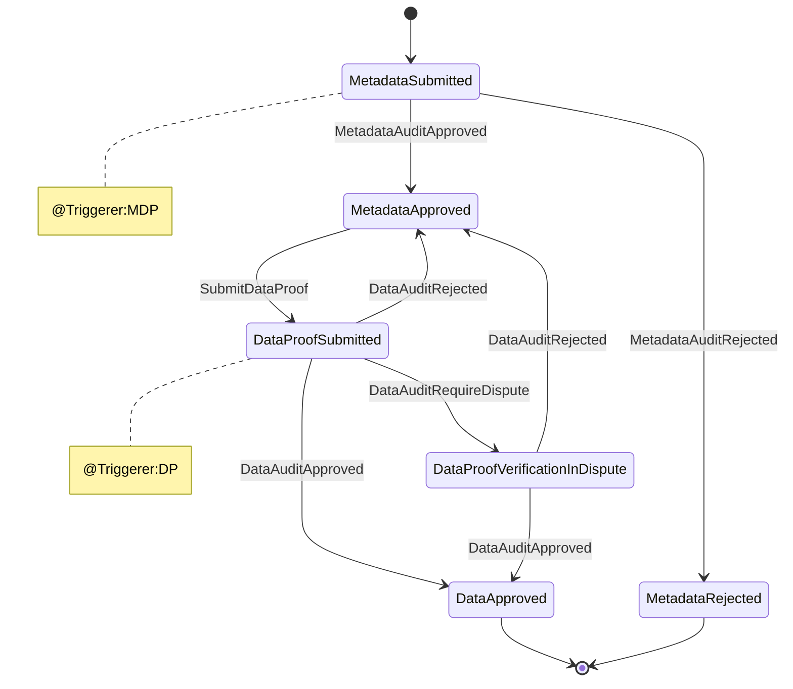
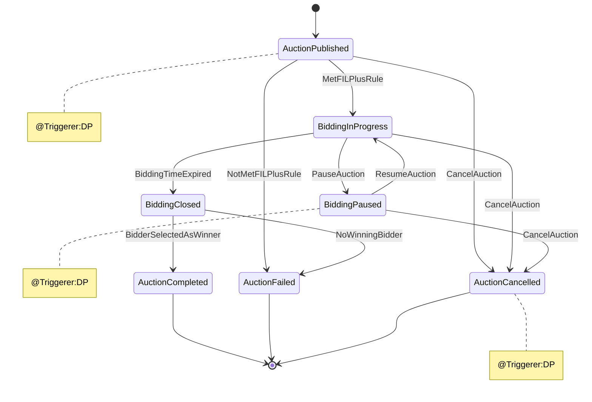
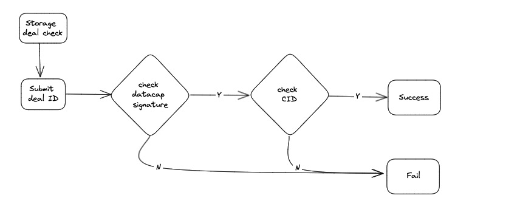
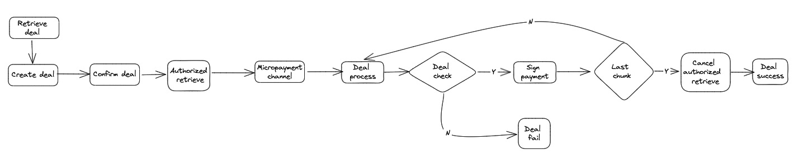
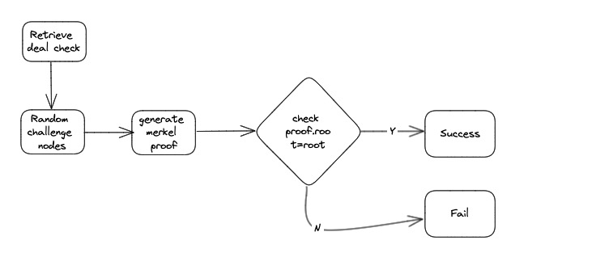
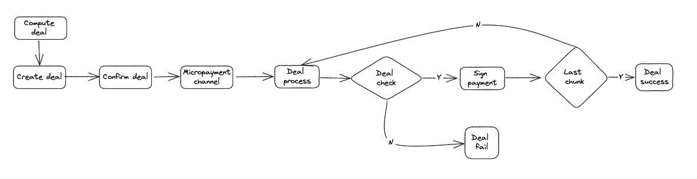
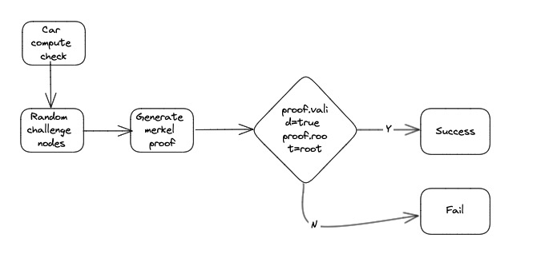
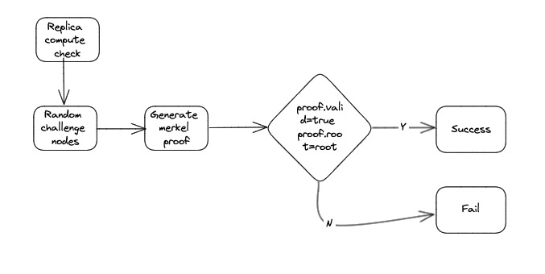
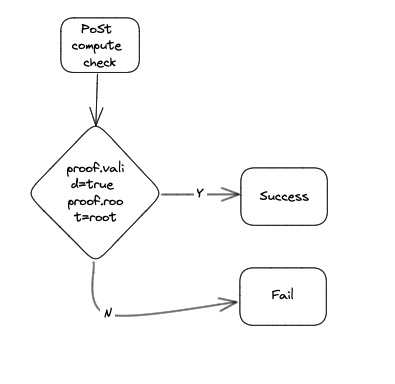

# 2. Systems

## 2.1 Roles
生态角色
|role|acronym|description|
|:--:|:--:|:--|
|Storage Provider|SP|(1)存储有用数据获取FIL奖励<br>(2)存储来自DataSwap的订单，获取生态奖励|
|Retrieve Provider|RP|(1)提供检索获取FIL奖励<br>(2)提供DataSwap检索节点，提供检索服务，获取生态奖励|
|Compute Provider|CP|(1)提供大数据分析挖掘服务,获取FIL或者生态奖励<br>(2)提供生态常规计算，如DP计算、Seal计算、Proof计算获取FIL或者生态奖励|
|Metadata Provider|MDP|(1)提供全球范围内的有用数据集元数据，按照规范提交至DataSwap,获取生态建设者奖励|
|Data Provider|DP|(1)将注册成功的元数据集下载、证明,形成可在DataSwap交易的数据包,获取生态建设者奖励|
|Metadata Auditor|MDA|(1)审核dataset元数据有效性，获取生态建设者奖励|
|Data Auditor|DA|(1)审核dataset源数据有效性，获取生态建设者奖励|
|Retrieve Client|/|(1)花费FIL获取检索服务|
|Compute Client|/|(1)花费FIL获取计算服务|

## 2.2 Data Authentication
该章节描述符合[filecoin关于无须信任公证人设计构想](https://medium.com/filecoin-plus/ideation-trustless-notary-design-space-guidelines-bc21f6d9d5f2)的具体设计。

根据上文，该设计需符合无需信任公证人(Trustless notary)推荐方针：

- 无须信任公证人的所有者应该像其他公证人一样进行公证人选举，并在其应用程序中证明为什么提议的逻辑和改变该逻辑的治理流程足够公平。
- 一旦投入生产，应该至少有x个其他公证人“拥有”私钥来升级智能合约的逻辑。这意味着在代理合约指向新的升级合约之前，多个利益相关者必须达成一致。
- 与其他公证人一样，无须信任公证人必须由根密钥持有者授予 datacap，并受到与其他公证人相同的处罚。根密钥持有者可以从智能合约中删除datacap。
- 无须信任公证人必须有明确的文档，并且其代码必须开源以供任何人查看。
- 无须信任公证人应该包括一个“终止开关”，可以立即暂停合约的所有操作。

本设计中无须认证公证人在系统中位置及功能总体


### 2.2.1 数据集一致性校验算法

本设计提出数据一致性校验算法，赋能有效数据存储，支撑无须信任公证人实现:
- 实现对有效数据的存储的证明和校验；
- 以更细的粒度监控客户有效数据存储和校验；
- 通过代码降低公证人工作的复杂度；
- 将datacap和公证人签名解耦，从而避免作恶行为；

//TODU:文档详细说明

数据一致性校验算法基本原理如下图所示:


### 2.2.2 合约设计
无须认证公正人合约实现下述三个主要功能
- Dataset Register : 由MDP提交数据集信息，标题、行业分类、名称、描述、数据来源、所有者、创建时间、创建者、修改历史，由MDA向合约提交内容审核结果，确认源内容与MDP提交的数据集信息是否一致；
- Dataset Proof : DP利用数据证明工具（根据数据集一致性算法设计）生成数据集证明，即数据集证明mekeles树,合约校验数据集证明是否为一颗完整的merkle树；
- Dataset Verify : DA利用数据证明校验生成工具（根据数据集一致性算法设计）生成数据集证明校验，合约汇总校验信息，判断数据证明是否有效，如果数据集证明有效则说明数据集证明merkle树是源数据在一致性算法下的唯一水印，可以发布数据；
  
#### 2.2.2.1 DataSet合约设计


```js
    //action: Must send solidity event after state changed
    enum DatasetState{
        MetadataSubmitted,
        MetadataApproved,
        DataProofSubmitted,
        DataApproved,
        DataProofVerificationInDispute,
        MetadataRejected
    }
    enum DatasetEvent{
        MetadataAuditApproved,
        MetadataAuditRejected,
        SubmitDataProof,
        DataAuditApproved,
        DataAuditRejected,
        // DataAuditRequireDispute event from chain
        DataAuditRequireDispute,
    }
```


详细内容见[DataSet合约设计](./dataAuthentication/README.md#21-dataset合约设计)

#### 2.2.2.2 TrustlessNotary合约设计
TrustlessNotary合约实现数据集内容提交集审核逻辑、数据集证明提交及校验、数据集证明验证信息提交及校验

详细内容见[TrustlessNotary合约设计](./dataAuthentication/README.md#22-trustlessnotary合约设计)

### 2.2.3 数据集证明工具集


## 2.3 Data Deals

### 2.3.1 Storage Deal

存储交易是web2网络存储数据转入到web3网络存储的数据入口点，完成Data Provider在链上发布、和Storage Provider协商、完成校验存储交易功能。

具体包括以下功能：

- 数据撮合拍卖功能，支持大数据集拆分子订单拍卖。
- 存储交易管理功能。
- datacap管理功能。
- 数据集管理功能。

存储交易流程如下：
```js
    enum AuctionState{
        AuctionPublished,
        BiddingInProgress,
        BiddingPaused,
        BiddingClosed,
        AuctionCompleted,
        AuctionCancelled,
        AuctionFailed
    }
    enum AuctionEvent{
        MetFILPlusRule,
        NotMetFILPlusRule,
        PauseAuction,
        ResumeAuction,
        CancelAuction,
        BiddingTimeExpired,
        NoWinningBidder,
        NoWinningBidder
    }
```



存储交易检查流程如下：



[详细功能介绍](./dataDeals/README.md#Storage_Deal)

### 2.3.2 Retrieve Deal

检索交易提供web3存储数据检索业务，Retrieve Client查找到所需要数据集，通过检索交易获取所需要的数据集。

具体包括以下功能：

- 数据集检索功能
- 数据集下载交易功能

检索交易流程如下：



检索交易检查流程如下：



[详细功能介绍](./dataDeals/README.md#Retrieve_Deal)

### 2.3.3 Compute Deal

计算交易提供计算功能，Compute Client发布计算任务单，通过计算交易获取所需要的计算结果。

具体包括以下功能：

- 计算撮合功能。
- 计算交易管理功能。

计算交易流程如下：



计算交易car检查流程如下：



car检查根据其实际应用特性，除了计算过程的证明校验，来证明一直在工作；在最终收货阶段，还需要进行一次完全性校验，来保证交付物的完整可用。

计算交易Replica检查流程如下：

  

计算交易PoSt检查流程如下：  



[详细功能介绍](./dataDeals/README.md#Compute_Deal)
## 2.4 Role
成员治理提供如下功能
- 成员角色和权限
    定义不同的成员角色，并为每个角色分配适当的权限级别。确保成员只能执行其授权的操作。
    - 成员角色
       详见[角色列表](#21-roles)
    - 权限管理
        - 使用智能合约来管理审核权限。根据角色和权限，限制只有授权的成员才能进行审核操作。
        - 可以定义不同级别的权限，例如审核员、审核管理员等，以确保审核过程的控制和安全性。
        - 按贡献度划分等级，例如：贡献者、专家、管理员

- 成员加入和退出流程
        定义明确的加入和退出流程，确保新成员能够顺利加入数据DAO，而退出的成员可以被正确处理。包括成员注册、身份验证、访问权限分配等步骤。
        - 成员注册
        - 成员权限申请
        - 成员权限审核
        - 成员退出

合约[详细功能介绍](./roles/README.md#成员管理合约设计)


## 2.5 Reputation
- SP 声誉
- RP 声誉
- CP 声誉
- MDP 声誉
- DP 声誉
- MDA 声誉
- DA 声誉

## 2.6 Rewards
设计SP,RP,CP,MDP,DP,MDA,DA激励相容机制