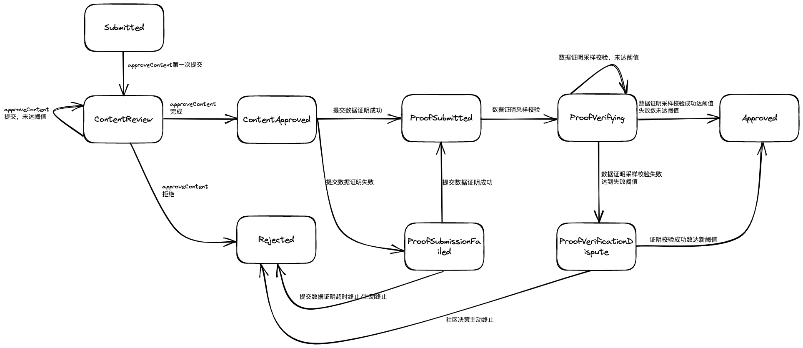

# 2. Systems

## 2.1 Roles
生态角色
|role|acronym|description|
|:--:|:--:|:--|
|Storage Provider|SP|(1)存储有用数据获取FIL奖励 (2)存储来自BigdataDAO的订单，获取BDF奖励|
|Retrieve Provider|RP|(1)提供检索获取FIL奖励 (2)提供BigdataDAO检索节点，提供检索服务，获取BDF奖励|
|Compute Provider|CP|(1)提供大数据分析挖掘服务,获取FIL或者BDF服务奖励 (2)提供生态常规计算，如DP计算、Seal计算、Proof计算获取FIL或者BDF服务奖励|
|Metadata Provider|MDP|(1)提供全球范围内的有用数据集元数据，按照规范提交至BigdataDao,获取生态建设者BDF奖励|
|Fulldata Provider|FDP|(1)将注册成功的元数据集下载、证明,形成可在BigdataDAO交易的数据包,获取生态建设者BDF奖励|
|Metadata Reviewer|MDR|(1)审核dataset元数据有效性，获取生态建设者BDF奖励|
|Fulldata Reviewer|FDR|(1)审核dataset源数据有效性，获取生态建设者BDF奖励|
|Retrieve Client|/|(1)花费BDF获取检索服务|
|Compute Client|/|(1)花费BDF获取计算服务|

## 2.2 Data Authentication
该章节描述符合[filecoin关于无须信任公证人设计构想](https://medium.com/filecoin-plus/ideation-trustless-notary-design-space-guidelines-bc21f6d9d5f2)的具体设计。

根据上文，该设计需符合无需信任公证人(Trustless notary)推荐方针：

- 无须信任公证人的所有者应该像其他公证人一样进行公证人选举，并在其应用程序中证明为什么提议的逻辑和改变该逻辑的治理流程足够公平。
- 一旦投入生产，应该至少有x个其他公证人“拥有”私钥来升级智能合约的逻辑。这意味着在代理合约指向新的升级合约之前，多个利益相关者必须达成一致。
- 与其他公证人一样，无须信任公证人必须由根密钥持有者授予 datacap，并受到与其他公证人相同的处罚。根密钥持有者可以从智能合约中删除datacap。
- 无须信任公证人必须有明确的文档，并且其代码必须开源以供任何人查看。
- 无须信任公证人应该包括一个“终止开关”，可以立即暂停合约的所有操作。

本设计中无须认证公证人在系统中位置及功能总体

### 2.2.1 数据集一致性校验算法

本设计提出数据一致性校验算法，赋能有效数据存储，支撑无须信任公证人实现:
- 实现对有效数据的存储的证明和校验；
- 以更细的粒度监控客户有效数据存储和校验；
- 通过代码降低公证人工作的复杂度；
- 将datacap和公证人签名解耦，从而避免作恶行为；

//TODU:文档详细说明

### 2.2.2 合约设计
无须认证公正人合约实现下述三个主要功能
- Dataset Register : 由MDP提交数据集信息，标题、行业分类、名称、描述、数据来源、所有者、创建时间、创建者、修改历史，由MDR向合约提交内容审核结果，确认源内容与MDP提交的数据集信息是否一致；
- Dataset Proof : FDP利用数据证明工具（根据数据集一致性算法设计）生成数据集证明，即数据集证明mekeles树,合约校验数据集证明是否为一颗完整的merkle树；
- Dataset Verify : FDR利用数据证明校验生成工具（根据数据集一致性算法设计）生成数据集证明校验，合约汇总校验信息，判断数据证明是否有效，如果数据集证明有效则说明数据集证明merkle树是源数据在一致性算法下的唯一水印，可以发布数据；
  
#### 2.2.2.1 DataSet合约设计
DataSet合约实现数据集信息注册、数据集状态变更、数据集查询、数据证明信息查询功能

数据集被注册到合约开始在无须信任公证人合约中的评审的状态流转如下

详细内容见[DataSet合约设计](./dataAuthentication/README.md#dataset合约设计)

#### 2.2.2.2 TrustlessNotary合约设计
TrustlessNotary合约实现数据集内容提交集审核逻辑、数据集证明提交及校验、数据集证明验证信息提交及校验

详细内容见[TrustlessNotary合约设计](./dataAuthentication/README.md#trustlessnotary合约设计)

### 2.2.3 数据集证明工具集

## 2.3 Data Deals

### 2.3.1 Storage Deal

### 2.3.2 Retrieve Deal

### 2.3.3 Compute Deal

## 2.4 Reputation
- SP 声誉
- RP 声誉
- CP 声誉
- MDP 声誉
- FDP 声誉
- MDR 声誉
- FDR 声誉

## 2.5 Rewards
设计SP,RP,CP,MDP,FDP,MDR,FDR激励相容机制
设计BDF的奖励机制