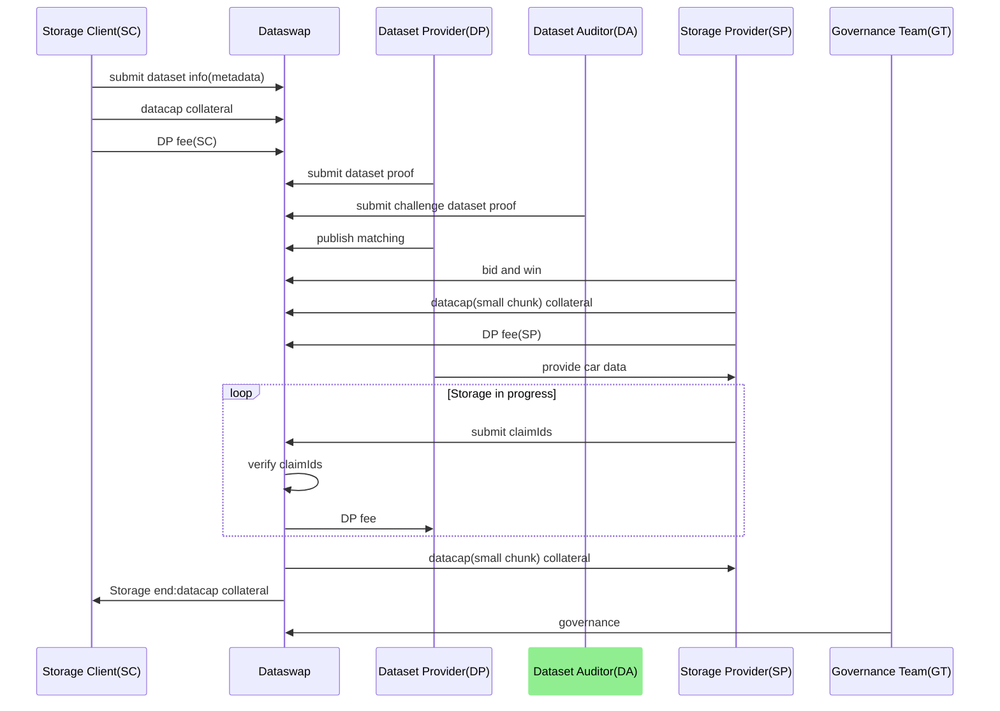
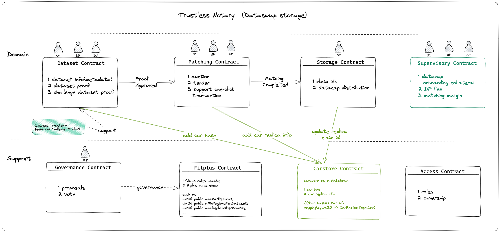
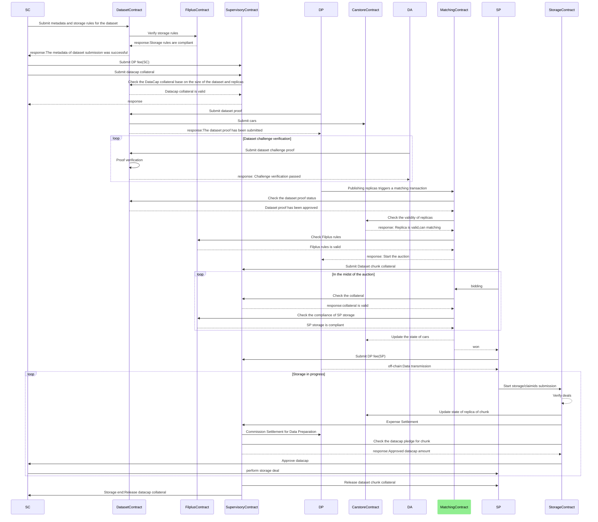
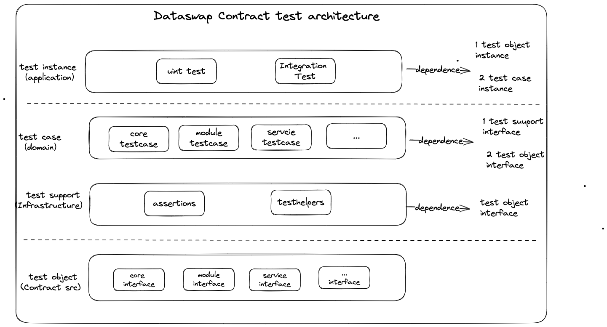

# 2. Systems

## 2.1 Trustless notary
### 2.1.1 Dataswap storage overview

### 2.1.2 Dataswap storage overall process

### 2.1.3 Dataswap storage diagram

### 2.1.4 Dataswap storage runtime sequence diagram

### 2.1.5 Concepts 
**Dataswap storage (Service) fully satisfies the specific design requirements of "Trustless Notary Design Space" outlined in the [Filecoin ideation article](https://medium.com/filecoin-plus/ideation-trustless-notary-design-space-guidelines-bc21f6d9d5f2).**

Dataswap storage provides a complete solution through dataset auditing, matching, automatic datacap allocation, and  storage.

The Dataset module, specifically DatasetMetadata, DatasetProof, and DatasetVerification, plays a crucial role in implementing the Trustless Notary.

- **DatasetMetadata:**

  - 1. Metadata Provider (MDP) submits dataset information such as title, industry category, name, description, data source, owner, creation time, creator, modification history, etc., to the business contract.
  - 2. MDP initiates an audit request to the governance contract.
  - 3. Metadata Auditor (MDA) submits the content audit result to the governance contract to verify if the source content matches the dataset information submitted by MDP.
  - 4. After MDA's vote, the governance contract calls the business contract to approve or reject the DatasetMetadata.

- **DatasetProof:**

  - The DatasetProof (DP) utilizes data proof tools (designed based on [Dataset Consistency Algorithm](../algorithms/README.md#2-dataset-consistency-algorithm)s) to generate dataset proofs, specifically the dataset proof Merkle tree.
  - DP submits the dataset proof to the business contract.

- **DatasetVerification:**

  - Dataset Auditor (DA) uses data proof verification tools (designed based on [Dataset Consistency Algorithm](../algorithms/README.md#2-dataset-consistency-algorithm)s) to generate dataset challenge proof verification information.
  - DA submits the dataset challenge proof verification information to the business contract.
  - After all DAs vote to the governance contract.the governance contract determines the final approval of the Dataset based on the audit results from all DAs.

In summary, Dataswap storage, through its dataset module components (DatasetMetadata, DatasetProof, and DatasetVerification), addresses the specific design requirements of a Trustless Notary as described in the Filecoin ideation article.

### 2.1.6 Dataset Consistency Verification Algorithm
**Note:Algorithm prototype validation has been successfully passed.**

See [Dataset Consistency Algorithm](../algorithms/README.md#2-dataset-consistency-algorithm) for details.

### 2.1.7 Dataset Consistency Proof and verification Toolset
**Note:Algorithm prototype validation has been successfully passed.**

The Dataset Consistency Proof Toolset is used to implement the consistency proof algorithm, including the generation of dataset proofs, source data sampling, and verification tools etc.
See [Consistency Proof and verify Toolset Design](../algorithms/README.md#3-dataset-consistency-proof-and-verification-toolset) for details.

## 2.2 Architecture
### 2.2.1 Contract Architecture

### 2.2.2 Test Architecture

## 2.3 detail architecture design
### 2.3.1 core layer(You can consider it as the infrastructure layer.)
|module|status|
|:---:|:---:|
|[access](./core/access/Readme.md)|Draft/WIP|
|[filecoin](./core/filecoin/Readme.md)|Draft/WIP|
|[filplus](./core/filplus/Readme.md)|Draft/WIP|
|[carstore](./core/carstore/Readme.md)|Draft/WIP|
|[token](./core/token/Readme.md)|Draft/WIP|
|[governance](./core/governance/Readme.md)|Missing|

### 2.3.2 module layer(You can consider it as the domain layer.)
|module|status|
|:---:|:---:|
|[dataset](./module/dataset/Readme.md)|Draft/WIP|
|[matching](./module/matching/Readme.md)|Draft/WIP|
|[storage](./module/storage/Readme.md)|Draft/WIP|
|[datacap](./module/datacap/Readme.md)|Draft/WIP|
|[retrieve](./module/retrieve/Readme.md)|Missing|
|[compute](./module/compute/Readme.md)|Missing|
|[reputation](./module/reputation/Readme.md)|Missing|
|[reward](./module/reward/Readme.md)|Missing|

### 2.3.3 service layer(You can consider it as the domain service layer.)
|module|status|
|:---:|:---:|
|[dataswapstorage](./service/dataswapstorage/Readme.md)|Draft/WIP|
|[dataswapretrieve](./service/dataswapretrieve/Readme.md)|Missing|
|[dataswapcompute](./service/dataswapcompute/Readme.md)|Missing|
