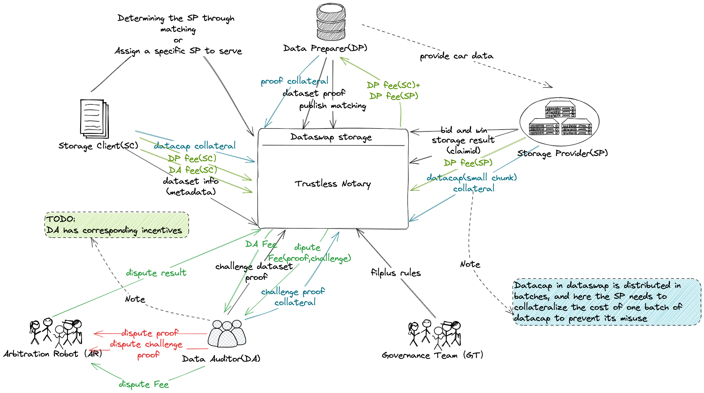
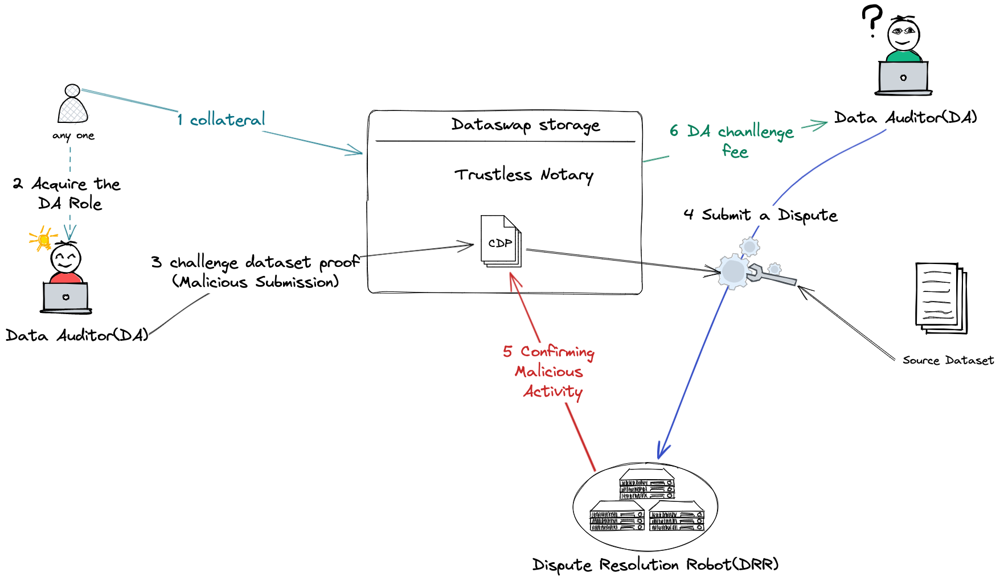
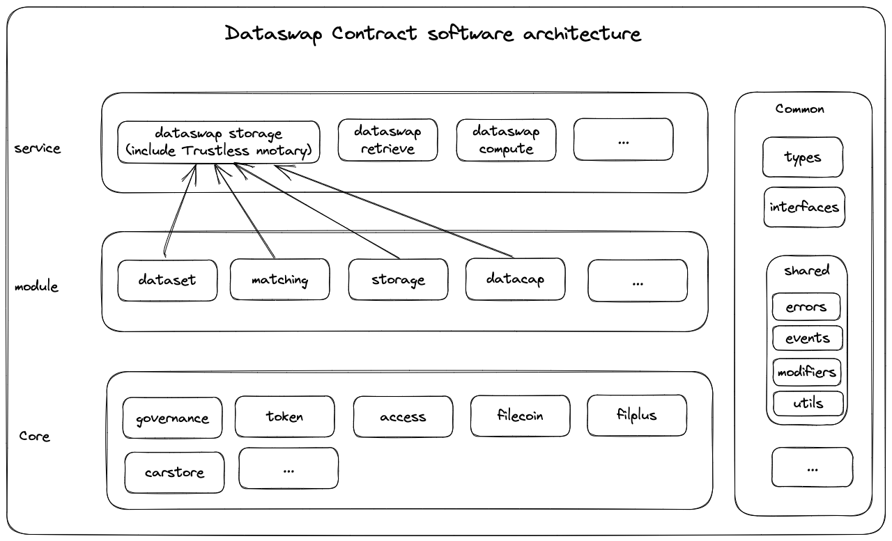
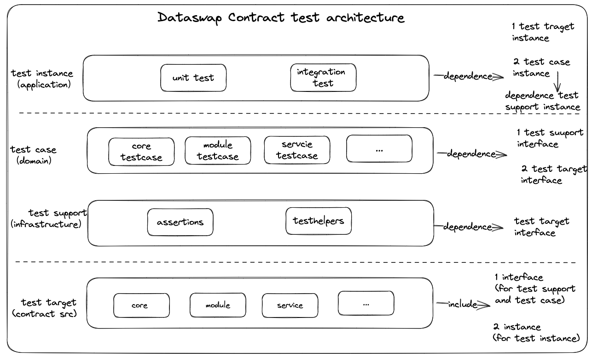

# 2. Systems

## 2.1 Trustless notary
### 2.1.1 Dataswap storage overview

### 2.1.2 Handling Sybil Attacks

In the above-mentioned system, how to prevent Sybil attacks by DAs (collusion between DP and DA) is a critical issue. In the absence of malicious behavior by DAs, dataset consistency algorithms can prevent collusion and other malicious activities among SC, DP, and SP.

Here is the operational process through which DAs can prevent Sybil attacks:

- DA's admission requires staking, and anyone can become a DA by submitting a stake. DA's admission stake can only be released after the dataset audit is completed.
- Only after becoming a DA can one earn DA fees and DA challenge fees.
  - DA fees are the fees earned by DAs for correctly submitting proofs for datasets.
  - DA challenge fees refer to fees earned by DAs when they successfully challenge other DAs' proofs, which are found to be fraudulent.
- If a DA discovers that another DA has submitted a false proof for a dataset, they can submit a dispute to the dispute resolution robot.
- The dispute resolution robot is a voting cluster built by a trusted community organization to handle DA disputes. It is only activated when a dispute arises, and it completes the dispute resolution.
- When the dispute resolution results in a successful challenge, the staked amount of the challenged DA is forfeited, and it is used to pay the fees for both the challenging DA and the dispute resolution robot.
- A DA that has been successfully challenged has their staked amount forfeited and loses their DA role authorization.

### 2.1.3 Dataswap storage overall process

### 2.1.4 Dataswap storage diagram

### 2.1.5 Dataswap storage runtime sequence diagram

### 2.1.6 Concepts 
**Dataswap storage (Service) fully satisfies the specific design requirements of "Trustless Notary Design Space" outlined in the [Filecoin ideation article](https://medium.com/filecoin-plus/ideation-trustless-notary-design-space-guidelines-bc21f6d9d5f2).**

Dataswap storage provides a complete solution through dataset auditing, matching, automatic datacap allocation, and  storage.

The Dataset module, specifically DatasetMetadata, DatasetProof, and DatasetVerification, plays a crucial role in implementing the Trustless Notary.

- **DatasetMetadata:**

  - Storage Client (SC) submits dataset information such as title, industry category, name, description, data source, owner, creation time, creator, modification history, etc., to the dataset contract.
  - Storage Client (SC) submits Datacap collateral to the Supervisory Contract based on the dataset's storage capacity to obtain access rights to the Datacap.

- **DatasetProof:**

  - The Data Preparer (DP) utilizes data proof tools (designed based on [Dataset Consistency Algorithm](../algorithms/README.md#2-dataset-consistency-algorithm)s) to generate dataset proofs, specifically the dataset proof Merkle tree.
  - DP submits the dataset proof to the dataset contract.

- **DatasetVerification:**

  - Data Auditor (DA) uses data proof verification tools (designed based on [Dataset Consistency Algorithm](../algorithms/README.md#2-dataset-consistency-algorithm)s) to generate dataset challenge proof verification information.
  - DA submits the dataset challenge proof verification information to the dataset contract.
  - After all DAs vote to the governance contract.the governance contract determines the final approval of the Dataset based on the audit results from all DAs.

In summary, Dataswap storage, through its dataset module components (DatasetMetadata, DatasetProof and DatasetVerification), addresses the specific design requirements of a Trustless Notary as described in the Filecoin ideation article.

The Matching module implements decentralized matchmaking functionality.
  - Data Preparer (DP) participate in auctions within the matching contract to store their prepared datasets.
  - Data Preparer (DP) need to ensure that their data is transferred (if the transaction is successful, they will send the data) to the winning SP. DP also needs to assist SP in completing the data onboarding process to receive their DP fee.
  - SPs pre-stake funds in the supervisory contract to participate in dataset auctions and obtain validated dataset storage transactions.
  - Storage Provider (SP) who bid during the matching period commit to completing data onboarding within a specific window after the auction ends. If they fail to do so, they forfeit their collateral.

The storage module implements dataset onboarding management.
  - When a Storage Provider (SP) wins the auction, the storage contract automatically approves Datacap for the SC without requiring any additional authorization.
  - After the Storage Provider (SP) completes the storage, they submit the Claim ID to the storage contract to ensure the correct onboarding of data. If there are non-compliant data onboarding issues, the storage contract will halt Datacap approval.

### 2.1.7 Dataset Consistency Verification Algorithm
**Note:Algorithm prototype validation has been successfully passed.**

See [Dataset Consistency Algorithm](../algorithms/README.md#2-dataset-consistency-algorithm) for details.

### 2.1.8 Dataset Consistency Proof and verification Toolset
**Note:Algorithm prototype validation has been successfully passed.**

The Dataset Consistency Proof Toolset is used to implement the consistency proof algorithm, including the generation of dataset proofs, source data sampling, and verification tools etc.
See [Consistency Proof and verify Toolset Design](../algorithms/README.md#3-dataset-consistency-proof-and-verification-toolset) for details.

## 2.2 Architecture
### 2.2.1 Contract Architecture

### 2.2.2 Test Architecture

## 2.3 detail architecture design
### 2.3.1 core layer(You can consider it as the infrastructure layer.)
|module|status|
|:---:|:---:|
|[access](./core/access/Readme.md)|Draft/WIP|
|[filecoin](./core/filecoin/Readme.md)|Draft/WIP|
|[filplus](./core/filplus/Readme.md)|Draft/WIP|
|[carstore](./core/carstore/Readme.md)|Draft/WIP|
|[token](./core/token/Readme.md)|Draft/WIP|
|[governance](./core/governance/Readme.md)|Missing|

### 2.3.2 module layer(You can consider it as the domain layer.)
|module|status|
|:---:|:---:|
|[dataset](./module/dataset/Readme.md)|Draft/WIP|
|[matching](./module/matching/Readme.md)|Draft/WIP|
|[storage](./module/storage/Readme.md)|Draft/WIP|
|[datacap](./module/datacap/Readme.md)|Draft/WIP|
|[retrieve](./module/retrieve/Readme.md)|Missing|
|[compute](./module/compute/Readme.md)|Missing|
|[reputation](./module/reputation/Readme.md)|Missing|
|[reward](./module/reward/Readme.md)|Missing|

### 2.3.3 service layer(You can consider it as the domain service layer.)
|module|status|
|:---:|:---:|
|[dataswapstorage](./service/dataswapstorage/Readme.md)|Draft/WIP|
|[dataswapretrieve](./service/dataswapretrieve/Readme.md)|Missing|
|[dataswapcompute](./service/dataswapcompute/Readme.md)|Missing|
