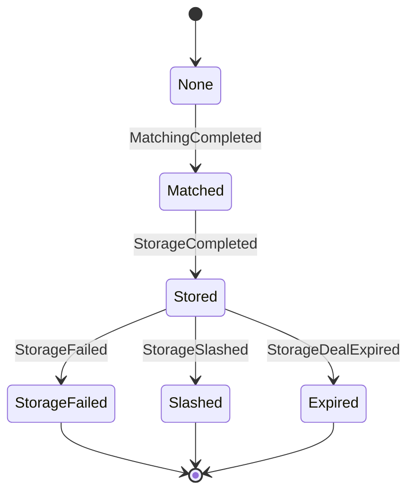

## CarStore

### 1 Concepts
The "carstore" serves as the foundational database within the DataSwap system, indexed by car CIDs (Content IDs), and is accessible for use by the module layer.

### 2 Type 
```js
    /// @notice Enum representing the possible states of a car replica.
    enum State {
        None, //justify if Replica exsits
        Matched, // Replica has been matched for storage
        Stored, // Replica has been successfully stored
        StorageFailed, // The filecoin deal's verification failed.
        Slashed, // The filecoin deal has been slashed.
        Expired // The filecoin deal has expired.
    }

    /// @notice Enum representing the events associated with car replicas.
    enum Event {
        MatchingCompleted, // Matching for a replica has been completed
        StorageCompleted, // Storage for a replica has been completed
        StorageFailed, // Storage for a replica has failed
        StorageDealExpired, // Storage deal for a replica has expired
        StorageSlashed // Storage for a replica has been slashed
    }

    /// @notice Struct representing a car replica.
    struct Replica {
        uint64 filecoinDealId; // ID of the Filecoin deal associated with the replica's storage
        State state; // Current state of the replica
    }

    /// @notice Struct representing a car and its associated replicas.
    struct Car {
        uint64 size; //car size
        uint64 datasetId; // Index of approved dataset
        uint16 replicasCount; // Number of replicas associated with the car
        mapping(uint64 => Replica) replicas; // Mapping from matchingId => Replica details
    }
```
### 3 State Variabless
```js
uint64 public carsCount;
///Car CID=> Car
mapping(bytes32 => Car) internal cars;
```

### 4 Car replica state machine


### 5 Interface
```js
/// @title ICarStore
/// @notice This interface defines the functions for managing car data and associated replicas.
interface ICarstore {
    /// @dev Add a car based on its CID.
    ///      tips: diffent dataset has the same car is dones't matter,maybe need limit replicas count for a car.
    ///      filplus requires dataset replicas,but not limit for car replicas
    /// @param _cid Car CID to be added.
    /// @param _datasetId dataset index of approved dataset
    /// @param _size car size
    function addCar(bytes32 _cid, uint64 _datasetId, uint64 _size) external;

    /// @notice Add multiple cars to the storage.
    /// @dev This function allows the addition of multiple cars at once.
    /// @param _cids Array of car CIDs to be added.
    /// @param _datasetId dataset index of approved dataset
    /// @param _sizes car size array
    function addCars(
        bytes32[] memory _cids,
        uint64 _datasetId,
        uint64[] memory _sizes
    ) external;

    /// @notice Add a replica to a car.
    /// @dev This function allows adding a replica to an existing car.
    /// @param _cid Car CID to which the replica will be added.
    /// @param _matchingId Matching ID for the new replica.
    function addCarReplica(bytes32 _cid, uint64 _matchingId) external;

    /// @notice Report that storage deal for a replica has expired.
    /// @dev This function allows reporting that the storage deal for a replica has expired.
    /// @param _cid Car CID associated with the replica.
    /// @param _matchingId Matching ID of the replica.
    function reportCarReplicaExpired(
        bytes32 _cid,
        uint64 _matchingId,
        uint64 _filecoinDealId
    ) external;

    /// @notice Report that storage of a replica has been slashed.
    /// @dev This function allows reporting that the storage of a replica has been slashed.
    /// @param _cid Car CID associated with the replica.
    /// @param _matchingId Matching ID of the replica.
    function reportCarReplicaSlashed(
        bytes32 _cid,
        uint64 _matchingId,
        uint64 _filecoinDealId
    ) external;

    /// @notice Set the Filecoin deal ID for a replica's storage.
    /// @dev This function allows setting the Filecoin deal ID for a specific replica's storage.
    /// @param _cid Car CID associated with the replica.
    /// @param _matchingId Matching ID of the replica.
    /// @param _filecoinDealId New Filecoin deal ID to set for the replica's storage.
    function setCarReplicaFilecoinDealId(
        bytes32 _cid,
        uint64 _matchingId,
        uint64 _filecoinDealId
    ) external;

    /// @notice Get the dataset ID associated with a car.
    /// @param _cid Car CID to check.
    /// @return The car size of the car.
    function getCarSize(bytes32 _cid) external view returns (uint64);

    /// @notice Get the dataset ID associated with a car.
    /// @param _cid Car CID to check.
    /// @return The dataset ID of the car.
    /// NOTE: a car only belongs a datasets
    function getCarDatasetId(bytes32 _cid) external view returns (uint64);

    /// @notice Get the replica details associated with a car.
    /// @param _cid Car CID associated with the replica.
    /// @param _matchingId Matching ID of the replica.
    /// @return The dataset ID, state, and Filecoin deal ID of the replica.
    function getCarReplica(
        bytes32 _cid,
        uint64 _matchingId
    ) external view returns (CarReplicaType.State, uint64);

    /// @notice Get the count of replicas associated with a car.
    /// @param _cid Car CID for which to retrieve the replica count.
    /// @return The count of replicas associated with the car.
    function getCarRepicasCount(bytes32 _cid) external view returns (uint16);

    /// @notice Get the Filecoin deal ID associated with a specific replica of a car.
    /// @param _cid Car CID associated with the replica.
    /// @param _matchingId Matching ID of the replica.
    /// @return The Filecoin deal ID of the replica.
    function getCarReplicaFilecoinDealId(
        bytes32 _cid,
        uint64 _matchingId
    ) external view returns (uint64);

    /// @notice Get the state of a replica associated with a car.
    /// @param _cid Car CID associated with the replica.
    /// @param _matchingId Matching ID of the replica.
    /// @return The state of the replica.
    function getCarReplicaState(
        bytes32 _cid,
        uint64 _matchingId
    ) external view returns (CarReplicaType.State);

    /// @notice Check if a car exists based on its CID.
    /// @param _cid Car CID to check.
    /// @return True if the car exists, false otherwise.
    function hasCar(bytes32 _cid) external view returns (bool);

    /// @notice Check if a replica exists within a car based on its matching ID.
    /// @param _cid Car CID to check.
    /// @param _matchingId Matching ID of the replica to check.
    /// @return True if the replica exists, false otherwise.
    function hasCarReplica(
        bytes32 _cid,
        uint64 _matchingId
    ) external view returns (bool);

    /// @notice Check if multiple cars exist based on their CIDs.
    /// @param _cids Array of car CIDs to check.
    /// @return True if all specified cars exist, false if any one does not exist.
    function hasCars(bytes32[] memory _cids) external view returns (bool);

    // Default getter functions for public variables
    function carsCount() external view returns (uint64);
}
```