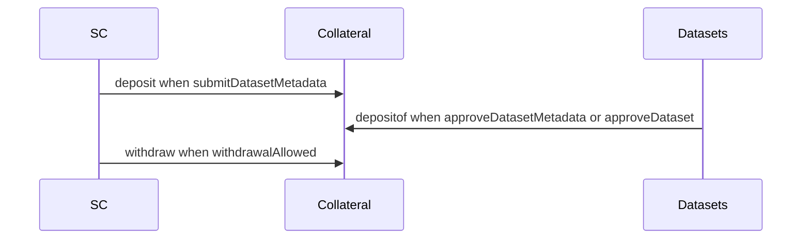
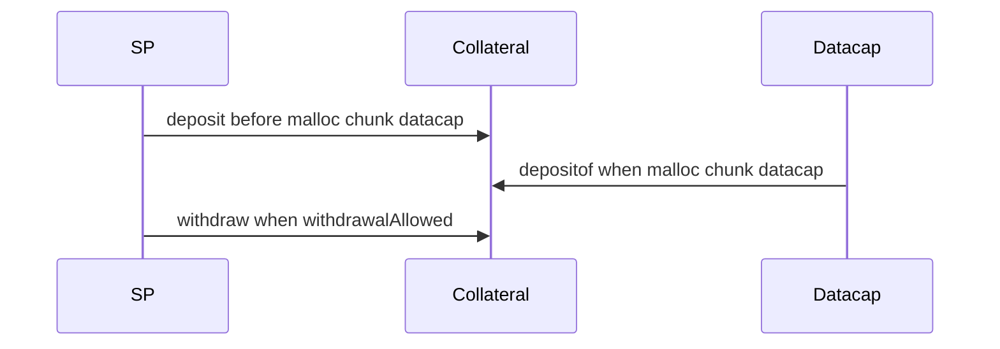
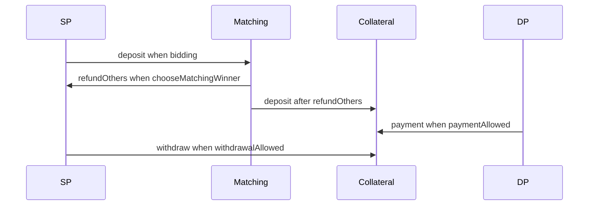

# collateral

## SC Collateral

```mermaid
sequenceDiagram
  SC ->> Collateral: deposit when submitDatasetMetadata
  Datasets ->> Collateral: depositof when approveDatasetMetadata or approveDataset
  SC ->> Collateral: withdraw when withdrawalAllowed
```

## SP Collateral

```mermaid
sequenceDiagram
  SP ->> Collateral: deposit before malloc chunk datacap
  Datacap ->> Collateral: depositof when malloc chunk datacap
  SP ->> Collateral: withdraw when withdrawalAllowed
```

## Datasets storage collateral and payment 

```mermaid
sequenceDiagram
  SP ->> Matching: deposit when bidding
  Matching ->> SP: refundOthers when chooseMatchingWinner
  Matching ->> Collateral: deposit after refundOthers
  DP ->> Collateral: payment when paymentAllowed
  SP ->> Collateral: withdraw when withdrawalAllowed
```
