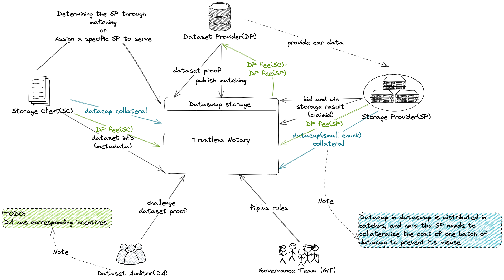
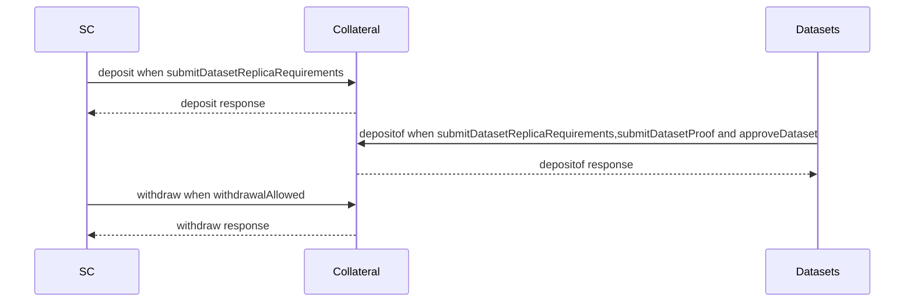
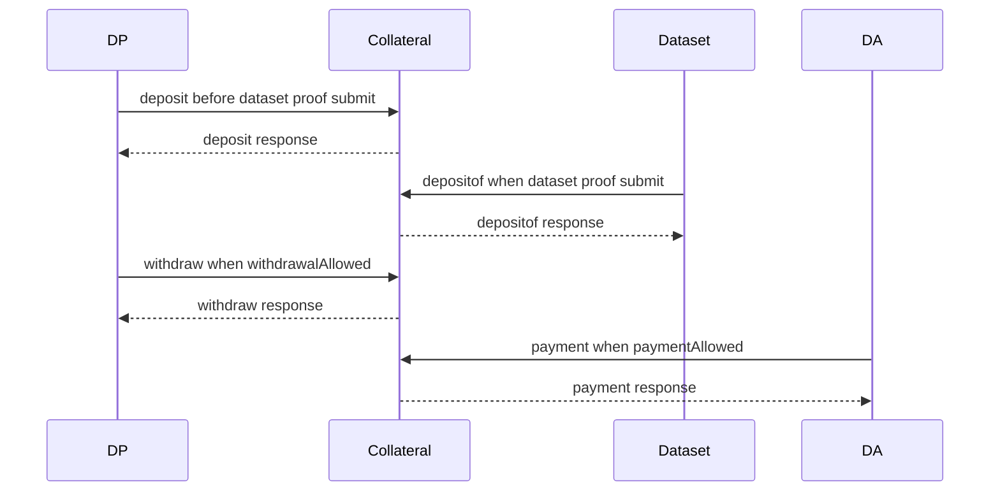
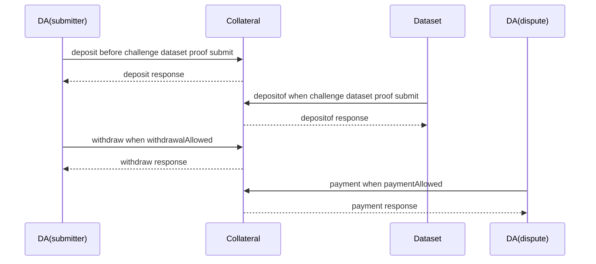
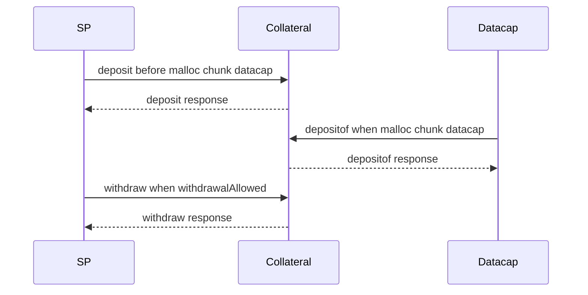
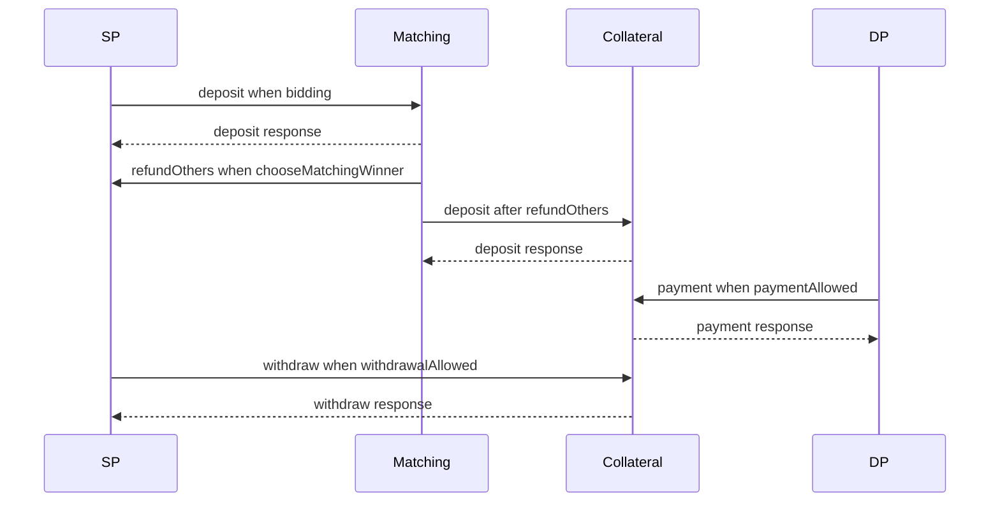
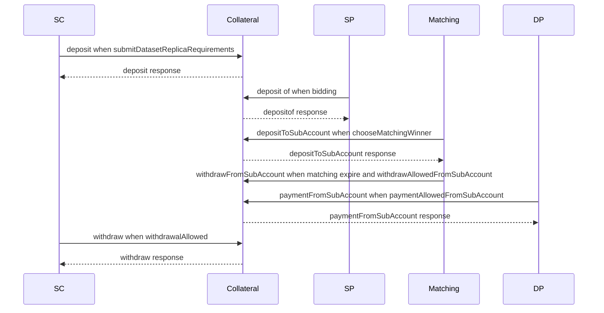
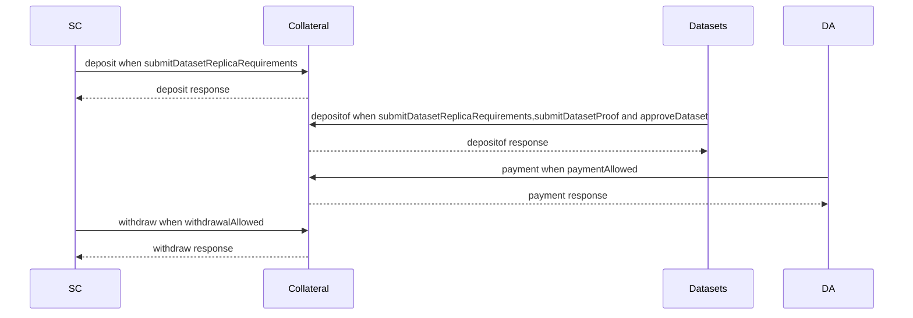
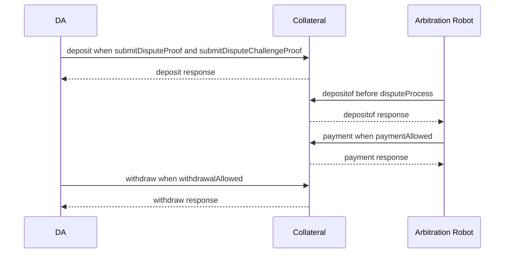

# Dataswap economic model design

## Terminology

SC: Storage Client  
SP: Storage Provider  
DP: Data Preparer  
DA: Data Auditor  
AR: Arbitration Robot  

## Overview

Dataswap involves capital circulation business and does not involve capital circulation business

> File a dispute and pay the dispute handling fee directly to the robot regardless of the outcome of the dispute

### Involving capital circulation business

#### 1. SC submits datacap pledge of metadata set

Purpose: Constrain SC to provide valid data.

Staking algorithm: ((dataset size)Bytes / 1024 / 1024 /1024 /1024)TiB *(replica count)*unit price per T
Redemption conditions: Metadata is rejected, or the data set is not approved beyond the maximum approval time (180 days), or the maximum pledge time is reached (365 days)
Redemption strategy: full redemption

> When submittingDatasetProof and approveDataset, the actual storage data size can be determined. At this time, check whether depositof meets the actual pledge requirements. If it does not meet the actual pledge requirements, SC needs to make up the fee.

#### 2. DP submits dataset proof for pledge

Purpose: Constrain DP to submit correct dataset proof, and encourage DA to arbitrate DP to submit incorrect dataset proof.

Staking algorithm: ((datacap size)Bytes / 1024 / 1024 /1024 /1024)TiB *Unit price per T
Redemption conditions: dataset is approved or rejected
Redemption strategy: All pledges that are not submitted for disputes during the arbitration period can be redeemed in full. If disputes are proven during the arbitration period, all pledges will be forfeited and cannot be redeemed.
Conditions for forfeiture: When a DA submits a dispute to the arbitration robot against the proof submitted by DP during the arbitration cycle, and it is verified by the arbitration robot as just and valid, the Proof pledge will be forfeited.
Penalty strategy: The pledge in the DP account is rewarded for submitting DA as a dispute reward, and the pledged funds are rewarded to the first DA who submits a proof of error.

> Inaccessible situation: If the DA proposes that the data set cannot be accessed and is verified by the arbitration robot as just and valid, the data set will not be approved and 90% of the pledge will be refunded. 10% reward to the first DA who proposes inaccessibility
If the DA proposes that the mapping file cannot be accessed and is verified as legitimate and valid by the arbitration robot, the data set will not be approved, the stake will be confiscated, and the reward will be given to the first DA who proposes that the mapping file is inaccessible.

#### 3. DA submits challenge dataset proof pledge

Purpose: Constrain DA to submit the correct challenge dataset proof. Incentivize DA to arbitrate DA to submit incorrect challenge dataset proof.

Staking algorithm: ((datacap size)Bytes / 1024 / 1024 /1024 /1024)TiB *Unit price per T
Redemption conditions: dataset is approved or rejected
Redemption strategy: Unsubmitted disputes can be redeemed in full, while disputed challenge proof pledges will be forfeited and cannot be redeemed.
Slashing conditions: When the challenge certificate submitted by the DA is submitted for dispute and confirmed to be valid by the dispute robot, the disputed pledge will be forfeited.
Slashing strategy: DA’s slashed pledge is given as a reward to the first committer who proposes a proof of error.

> Inaccessibility: The data set will not be approved if it is not accessible, and 90% of the pledge will be refunded. Reward to the first DA who proposes inaccessibility
If the mapping file cannot be accessed within the period, it will not be approved and will be forfeited.

#### 4. SP obtains small chunk datacap pledge

Purpose: Constrain SP to store data correctly.

Staking algorithm: ((datacap size)Bytes / 1024 / 1024 /1024 /1024)TiB *Unit price per T
Redemption conditions: End of storage period
Redemption strategy: If the data is stored correctly, the corresponding datacap pledge can be redeemed in full. If the data is not stored correctly, the corresponding datacap pledge will be forfeited and cannot be redeemed.
Forfeiture conditions: When an incorrect car is submitted, the corresponding datacap pledge will be forfeited, and the storage period ends. The corresponding datacap pledge for the unfinished storage car will be forfeited.
Penalty and forfeiture strategy: When SP applies for datacap pledge redemption, the forfeiture part is destroyed and the completed part is returned.

#### 5. SP stores data to pay DP fee

Purpose: To motivate DP calculations to prepare data.

Cost algorithm: ((datacap size)Bytes / 1024 / 1024 /1024 /1024)TiB *Unit price per T
Payment conditions: During the storage period, DP can withdraw the storage fees corresponding to all correctly stored data.
Payment strategy: DP obtains the storage fees corresponding to the correctly stored data in proportion to the total storage fees.
Refund conditions: After the storage expires, the storage fee corresponding to the data that is not stored correctly
Refund policy: After the storage expires, the storage fees corresponding to the data that were not stored correctly can be redeemed in full.

#### 6. SC pays DP fee

Purpose: To motivate DP calculations to prepare data.

Fee algorithm: any price
Payment conditions: During the storage period, DP can withdraw the storage fees corresponding to all correctly stored data.
Payment strategy: DP obtains the storage fees corresponding to the correctly stored data in proportion to the total storage fees.
Refund conditions: After the storage expires, the storage fee corresponding to the data that is not stored correctly
Refund policy: After the storage expires, the storage fees corresponding to the data that were not stored correctly can be redeemed in full.

> SC DP fee for all copies of the same data set is deposited into the same public account and divided equally according to the number of copies.

#### 7. SC submits dataset (metadata) to pay DA fee

Purpose: To motivate DA to do challenge dataset proof calculations.

Cost algorithm: ((datacap size)Bytes / 1024 / 1024 /1024 /1024)TiB *Unit price per T
Payment conditions: DA submits challenge dataset proof successfully
Payment strategy: All DAs who successfully submitted the challenge dataset proof will be equally divided
Redemption strategy: After the proof submission expires, if the data set is not submitted to challenge the proof, the DA Fee will be returned to the SC.

> When submitDatasetProof and approveDataset, the actual stored data size can be determined. At this time, check whether depositof reaches the actual required fee. If it does not, SC needs to make up the fee.

#### 8. DA submits dispute and pays dispute fee

Purpose: To motivate arbitration robots to do arbitration calculations.

Fee Algorithm: Fixed Fee
Payment Terms: End of Arbitration
Payment policy: Pay in full
Redemption strategy: After the dataset is approved or rejected, the full amount will be returned to DA before the arbitration is completed.

### Does not involve capital transfer business

#### Why does DP release matching without staking?

DP has already paid the calculation and storage cost (submit proof, or SP specifies DP). The purpose of publishing matching is to earn the DP fee paid by SP to store data. Therefore, it has the motivation to promote SP to store data, and does not need to be constrained by pledge. .

#### Why does SP storage data not need to be pledged?

After SP wins the matching, it has locked the DP fee to be paid for storing data into the contract. It has already paid the capital occupation cost, so it has the ability to promote the behavior of storing data and does not need to be constrained by pledge.
