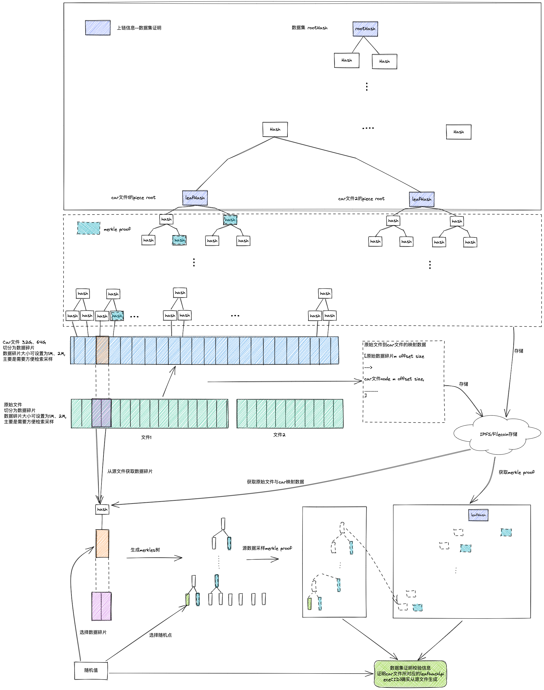
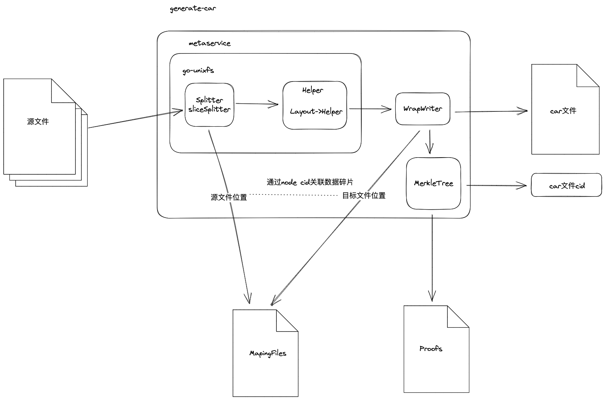

# 无须信任公证人设计

## 1 数据集一致性算法
### 1.1 一致性算法简介
基于一致性算法可以证明数据集原始数据与filecoin存储的数据集的一致性

我们知道filecoin存储交易的存储数据是car文件形式，每个数据集在filecoin上的存储最终体现为一系列car文件的存储完成
- 数据集一致性算法基于merkle证明，car文件的pieceCid是car文件的merkle树根hash,称为leafHash
- 由全部car文件的根hash构成数据集的一颗merkle树，merkle树的根为rootHash 这棵树被称为数据集证明，作为数据集的指纹，这一数据指纹存储到链上
- 一致性算法将每个car文件切分为数据碎片（1M\2M）car文件的数据碎片到car的根hash，即leafHash构成的merkle树称为，数据集的校验树，这些校验树存储到filecoin网络中
- 生成数据集校验树的过程中同时生成原始数据到car数据碎片的映射文件称为数据集校验树源文件；
- 通过校验树源文件和校验树，配合引入随机性可以通过从源文件获取数兆级别的原始文件生成随机采样点到leafHash的merkle证明，这可以证明原始文件是否在脸上数据集指纹锁代表的原始数据是否一致；
- 通过上述证明我们可以知道只要存储数据指纹中leafHash（即PieceCID）所对应的car文件，即存储了与原始数据一致的数据集文件；
- 上述所描述数据证明有和数据集校验信息的提交是DataSwap成员基于数据集一致性算法形成的共识；
- 因为leafHash（即PieceCID）被提前校验，在DataCap分配时可以将发放粒度控制到一个car文件级别的自动发放和管理；

### 1.2 一致性算法原理框图


## 2 无须信任公证人合约设计

### 2.1 DataSet合约设计
#### 2.1.1 对外依赖
依赖Role合约，获取数据集审批人列表
```
interface Role {
    // 获取数据集内容审核人
    // 获取证明提交人，提交人申请和分配逻辑在Role中实现
    function applyDatasetTask(uint256 datasetID, address[] memory excludedApprovers, uint256 count,bytes32 _role) external view returns (address[] memory)
}
```

#### 2.1.2 状态变量设计

##### 2.1.2.1 自定义数据结构

```
// 定义数据集状态
enum DatasetState {Submitted,ContentReview,ContentApproved,ProofSubmitting,ProofSubmitted,ProofSubmissionFailed,ProofVerifying,ProofVerificationDispute,Approved,Rejected}

// 定义数据集
struct Dataset {
    string title;         // 标题
    string industry;      // 行业分类
    string name;          // 名称
    string description;   // 描述
    string source;        // 数据来源
    string accessInfo;    // 描述源数据如何访问的字段
    address owner;        // 所有者
    uint256 createTime;   // 创建时间
    uint256 size;  // 数据集大小
    //uint256 数据属性，是否公共数据集
    uint64 version;
    bool noProofRequired;
}

// 数据集证明结构
struct DatasetProof {
    bytes32 rootHash;           // 根哈希
    bytes32[] leafHashes;       // 所有叶子节点哈希
    string leafAccessInfo;      // 叶子节点信息访问方式
    string metadataAccessInfo;  // 数据集证明元数据信息访问方式
}

// 定义发布信息
struct PublishInfo {
    uint32 numOfCopies;  // 副本数
    // TODO: 一个供应商最多存储几份副本 
    string version;       // 版本号
    uint256 releaseDate;  // 发布日期
    // TODO: 地域分布要求
}
```

##### 2.1.2.2 状态变量

```
uint256 public datasetCounter; // 计数器，用于生成递增的数据集ID
mapping(uint256 => Dataset) public datasets;
mapping(uint256 => DatasetState) private datasetStatus;
mapping(uint256 => DatasetProof) public datasetProofs;
mapping(uint256 => PublishInfo) public datasetPublishInfos;

```

#### 2.1.3 函数接口设计
##### 2.1.3.1 数据集注册
```
// 提交数据集注册请求，记录数据集状态为Submitted，生成 datasetID 并返回
function registry(
    string memory title,
    string memory industry,
    string memory name,
    string memory description,
    string memory source,
    string memory accessInfo,
    bool noProofRequired,
    address owner,
    uint256 size) internal returns (uint256)
```

##### 2.1.3.2 数据集状态更新
//数据集提交随着无须信任公证人合约处理状态不断变更

```
// 数据集状态变更事件
event DatasetStatusChanged(uint256 indexed datasetID, uint256 newStatus);

// 改变数据集状态，只允许内部调用
function updateState(uint256 datasetID, uint256 newStatus) internal {
    require(newStatus < uint256(DatasetState.Rejected), "Invalid status"); // 确保状态值有效
    datasetStatus[datasetID] = DatasetState(newStatus);
    emit DatasetStatusChanged(datasetID, newStatus);
}
```

##### 2.1.3.3 数据集证明提交

```
// 数据集提交接口，用于提交数据集证明
//TODO：只允许TrustlessNotary合约调用
function submitProof(
    uint256 datasetID,
    bytes32 rootHash,
    bytes32[] memory leafHashes,
    string memory leafAccessInfo,
    string memory metadataAccessInfo
) external
```

##### 2.1.3.4 获取数据集发布信息
```
// 获取数据集的发布信息
function getPublishInfo(uint256 datasetID) external view returns (PublishInfo memory)
```
##### 2.1.3.5 判断piece hash是否存在于数据集中
```
// 判断数据集的数据证明的 leafHashes 是否包含指定的哈希值
function isLeafHashInProof(uint256 datasetID, bytes32 leafHash) external view returns (bool)
```

### 2.2 TrustlessNotary合约设计
#### 2.2.1 对外依赖
依赖数据集合约

```
interface IDataSet {
    enum DatasetState {Submitted,ContentReview,ContentApproved,ProofSubmitting,ProofSubmitted,ProofSubmissionFailed,ProofVerifying,ProofVerificationDispute,Approved,Rejected}

    function registry(
        string memory title,
        string memory industry,
        string memory name,
        string memory description,
        string memory source,
        string memory accessInfo,
        bool noProofRequired,
        address owner,
        uint256 size
    ) external returns (uint256);

    function updateState(uint256 datasetID,uint256 newStatus) internal;
    function submitProof(uint256 datasetID,bytes32 rootHash,bytes32[] memory leafHashes,string memory leafAccessInfo,string memory metadataAccessInfo) external;
}
```

#### 2.2.2 状态变量设计
##### 2.2.2.1 自定义数据结构
```
/ 内容审核信息
struct ContentReviewStatus {
    bool approved;
    uint32 approvalCount;
    mapping(address => bool) approvals;
}

// 定义证明提交人信息结构
struct ProofInfo {
    address submitter;  // 证明提交人地址
    // 可添加其他相关信息
}

// 定义 Merkle 证明类型
enum VerifyType { Correctness, DataConsistencyDispute, MetadataInaccessibilityDispute }

// 定义数据集校验信息结构
struct DatasetVerificationInfo {
    uint64 proofRandomHeight;   // 证明随机值获取高度
    bytes32[] merkleProof;      // Merkle 证明
    mapping(bytes32 => bytes) sampleMapping;   // 采样点与源的映射关系信息
    VerifyType verifyType;    // 校验类型
    address submitter; //提交人
}

// 定义证明校验信息记录信息
struct ProofVerificationStatus {
    uint32 correctnessCount;       // 证明校验信息提交正确性计数
    uint32 consistencyErrorCount;  // 一致性错误计数
    uint32 metadataAccessCount;    // 元数据无法访问计数
}
```

##### 2.2.2.2 状态变量
```
// DataSet合约地址
address public dataSet;

// Role 合约地址
address public roleContract;
type ID address
// 内容审核状态映射
mapping(address => ContentReviewStatus) public datasetContentReviews;

// 为数据集增加证明提交人信息映射
mapping(address => ProofInfo) public proofInfos;

// 为数据集增加 Merkle 证明信息映射
mapping(address => DatasetVerificationInfo ) public datasetVerificationInfo;

// 证明校验提交状态映射
mapping(address => ProofVerificationStatus ) public datasetProofVerifications;

// 审批门限值
uint32 public contentThreshold;

// 数据集审批人数，默认为5人，可变更
uint32 public contentApproversCount = 5;

// 证明校验信息提交正确性阈值
uint32 correctnessThreshold;       

// 一致性错误阈值
uint32 consistencyErrorThreshold;  

// 元数据无法访问阈值
uint32 metadataAccessThreshold;    

// 数据集证明校验提交人数，默认为20人，可变更
uint32 public verificationSubmittersCount = 20;
```
#### 2.2.3 函数接口设计

##### 2.2.3.1 数据注册请求
向数据集合约注册数据集，获取数据集地址，本地初始化该数据集的内容审批信息，从Role合约获取审批人信息
> TODO：审核人超时未处理更新审核人逻辑

```
// 数据集注册事件
event DatasetRegistered(uint256 indexed datasetID, address indexed owner);

// 调用DataSet合约的注册函数
function registryDataset(
    string memory title,
    string memory industry,
    string memory name,
    string memory description,
    string memory source,
    string memory accessInfo, // 新增的字段：描述源数据如何访问
    bool noProofRequired,
    uint256 size  // 新增数据集大小字段
) external returns (uint256)
```

##### 2.2.3.2 内容审批提交
//内容开始审批变更数据集状态为ContentReview，审批人数达到审批门限则数据集状态变更为ContentApproved
```
 // 修饰器：验证是否是数据集的审批人
 modifier onlyContentApprovers(uint256 datasetID) {
     ContentReviewStatus storage reviewInfo = datasetContentReviews[datasetID];
     require(reviewInfo.approvals[msg.sender], "Only approvers can perform this action");
     _;
 }

 // 定义数据集审批事件
 event DatasetContentApproved(uint256 indexed datasetID, address indexed approver);

 // 提交内容审批通过
 function approveContent(uint256 datasetID) external onlyContentApprovers(datasetID)
// TODO: 被分配的审批成员必须在指定交易时间内提交审批
// 超时不提交审批，数据集提交人可以出发更换审批人

```
##### 2.2.3.3 数据集证明提交
```
// 修饰器：验证是否是数据集证明的提交人
modifier onlyProofSubmitter(uint256 datasetID) {
    ProofInfo storage proofInfo = proofInfos[datasetID];
    require(proofInfo.submitter == msg.sender, "Only proof submitter can perform this action");
    _;
}

// 增加证明提交接口，只能由证明提交人调用
function submitDatasetProof(
    uint256 datasetID,
    bytes32 rootHash,
    bytes32[] memory leafHashes,
    string memory leafAccessInfo,
    string memory metadataAccessInfo
) external
```

// TODO: 被分配的证明提交人必须在指定交易时间内提交证明
// 超时不提交数据集证明，数据集提交人可以出发更换证明人

##### 2.2.3.4 数据集证明验证
```
// 数据集证明校验接口，用于验证数据集证明中的 rootHash 和 leafHashes 是否构成一棵 Merkle 树
function verifyDatasetProof(bytes32 rootHash, bytes32[] memory leafHashes) private pure returns (bool) {
    // 在此实现验证数据集证明的逻辑
    // TODO:实现细节，您可以根据实际需求编写验证逻辑
    // 返回 true 表示验证通过，返回 false 表示验证失败
}
```

##### 2.2.3.5 校验信息提交
数据集证明提交后允许提交三种类型的校验信息：
正确性证明:Correctness
一致性争议:DataConsistencyDispute
元数据访问性争议:MetadataInaccessibilityDispute
```
// 新增数据集校验信息提交接口，只能由证明提交人调用
function submitDatasetVerificationInfo(
    uint256 datasetID,
    bytes32[] memory merkleProof,
    uint64 proofRandomHeight,
    bytes32[] memory samplePoints,
    bytes[] memory sampleData,
    VerifyType verifyType
) external
```
//TODO：校验通过策略：正确性通过制定门限，争议低于指定门限则判定为成功，可发布数据集，否则判定为失败

##### 2.2.3.6 merkle证明校验 

```
// 新增一个私有函数来进行Merkle树的验证
function verifyMerkleProof(
    bytes32[] memory merkleProof,
    bytes32 rootHash,
    bytes32 leafHash,
    uint64 proofRandomHeight
) private pure returns (bool) {
    // 在此实现验证Merkle树的逻辑
    // TODO:实现细节，您可以根据实际需求编写验证逻辑
    // 返回 true 表示验证通过，返回 false 表示验证失败
}
```

##### 2.2.3.7 基本参数配置函数
```
// 设置数据集审批人数
function setContentApproversCount(uint32 _count) external onlyOwner {
    contentApproversCount = _count;
}

// 设置审批门限值
function setContentThreshold(uint32 _threshold) external onlyOwner {
    contentThreshold = _threshold;
}

// 设置证明校验信息提交正确性阈值
function setCorrectnessThreshold(uint32 threshold) external onlyOwner {
    correctnessThreshold = threshold;
}

// 设置一致性错误阈值
function setConsistencyErrorThreshold(uint32 threshold) external onlyOwner {
    consistencyErrorThreshold = threshold;
}

// 设置元数据无法访问阈值
function setMetadataAccessThreshold(uint32 threshold) external onlyOwner {
    metadataAccessThreshold = threshold;
}

// 设置数据集证明校验提交人数
function setVerificationSubmittersCount(uint32 count) external onlyOwner {
    verificationSubmittersCount = count;
}

```

## 3 一致性证明工具集设计

### 3.1 car生成工具
增加如下功能
    - 基于singularity改造
    - 数据集证明信息（上链）
    - 源文件与car的映射关系
    - 缓存树（car文件的merkle树,filecoin/ipfs存储）
	- 数据集原始文件扫描策略(含car文件大小配置)

参考工具：singularity(generate-car)、boost（验证参考项目）、依赖go-unixfs、go-car、go-unixfsnode

car生成工具通过对go-unixfs、go-ipfs-chunker、以及对Writer的改造，通过对generate-car扩展实现功能,原理如下:



#### 3.1.1 源文件扫描策略
// TODO: 构建源文件扫描策略使同一份源文件能够输出相同的数据集证明

#### 3.1.2 映射文件生成
映射文件生成基于对[generate-car](https://github.com/tech-greedy/generate-car)的改造完成，不影响generate-car原有功能，增加映射文件的保存

##### 3.1.2.1 go-unixfs二次开发设计
定义Helper接口

```
type Helper interface {
	Done() bool
	Next() ([]byte, error)
	GetDagServ() ipld.DAGService
	GetCidBuilder() cid.Builder
	NewLeafNode(data []byte, fsNodeType pb.Data_DataType) (ipld.Node, error)
	FillNodeLayer(node *FSNodeOverDag) error
	NewLeafDataNode(fsNodeType pb.Data_DataType) (node ipld.Node, dataSize uint64, err error)
	ProcessFileStore(node ipld.Node, dataSize uint64) ipld.Node
	Add(node ipld.Node) error
	Maxlinks() int
	NewFSNodeOverDag(fsNodeType pb.Data_DataType) *FSNodeOverDag
	NewFSNFromDag(nd *dag.ProtoNode) (*FSNodeOverDag, error)
}

```

实现Helper接口并对NewLeafDataNode重新封装，记录源数据构造node的源文件信息
定义Helper接口实例

```
// Helper回调函数,构造car文件node时将node cid及node类型回传
type HelperAction func(node ipld.Node, nodeType pb.Data_DataType)

// Helper接口实例
type WrapDagBuilder struct {
	db  *ihelper.DagBuilderHelper  //原Helper
	hcb HelperAction //helper回调函数
}

```

改造Layout和fillNodeRec采用Helper接口实现car文件dag布局,car文件的生成布局方法不改动，只在node加入dag时调用Helper回调将cid和节点类型传回

Layout策略如下:
```
//	       +-------------+
//	       |   Root 1    |
//	       +-------------+
//	              |
//	 ( fillNodeRec fills in the )
//	 ( chunks on the root.      )
//	              |
//	       +------+------+
//	       |             |
//	  + - - - - +   + - - - - +
//	  | Chunk 1 |   | Chunk 2 |
//	  + - - - - +   + - - - - +
//
//	                     ↓
//	When the root is full but there's more data...
//	                     ↓
//
//	       +-------------+
//	       |   Root 1    |
//	       +-------------+
//	              |
//	       +------+------+
//	       |             |
//	  +=========+   +=========+   + - - - - +
//	  | Chunk 1 |   | Chunk 2 |   | Chunk 3 |
//	  +=========+   +=========+   + - - - - +
//
//	                     ↓
//	...Layout's job is to create a new root.
//	                     ↓
//
//	                      +-------------+
//	                      |   Root 2    |
//	                      +-------------+
//	                            |
//	              +-------------+ - - - - - - - - +
//	              |                               |
//	       +-------------+            ( fillNodeRec creates the )
//	       |   Node 1    |            ( branch that connects    )
//	       +-------------+            ( "Root 2" to "Chunk 3."  )
//	              |                               |
//	       +------+------+             + - - - - -+
//	       |             |             |
//	  +=========+   +=========+   + - - - - +
//	  | Chunk 1 |   | Chunk 2 |   | Chunk 3 |
//	  +=========+   +=========+   + - - - - +

```

##### 3.1.2.2 go-ipfs-chunker二次开发设计

该包用于将原数据切分以构建dag，默认采用SizeSpliter将源数据按大小相等创建数据块，基于SizeSplider进行改造，在切分数据块时将源文件信息传回
定义splitter
```
type sliceSplitter struct {
	r    io.Reader     // 数据源
	size uint32        // 数据块切分的大小
	err  error

	srcPath string     // 记录原文件路径
	cb SplitterAction  // 允许外部传入回调函数获取原始文件读取信息
	offset uint64      // 记录当前文件读取offset
}
```

定义splitter回调函数,用于metaservice接受源文件数据
```
type SplitterAction func(srcPath string, offset uint64, size uint32, eof bool)
```
实现Splitter接口并通过SplitterAction实现源文件拆分信息的输出
```
type Splitter interface {
	Reader() io.Reader
	NextBytes() ([]byte, error) //封装对SplitterAction的调用实现源数据信息的采集
	Bytes(start, offset int) ([]byte, error)
}
```

##### 3.1.2.3 metasevice设计
metaservice以node cid追踪node源数据和car文件node之间的关联

```
//chunk meta数据定义
type ChunkMeta struct {
	SrcPath   string           `json:"srcpath"`    //该chunk 采集源文件的路径
	SrcOffset uint64           `json:"srcoffset"`  //该chunk data所在的源文件偏移
	Size      uint32           `json:"size"`       //该chunk data大小
	DstPath   string           `json:"dstpath"`    //该chunk所在的car文件路径
	DstOffset uint64           `json:"dstoffset"`  //该chunk在目标car中偏移
	NodeType  pb.Data_DataType `json:"nodetype"`   //node类型
	Cid       cid.Cid          `json:"cid"`        //node cid
	Links     []*ipld.Link           `json:links`  // node的chunk,即子node
}

//获取一个chunk在目标car中的start和结束位置
func (cm *ChunkMeta) GetDstRange(c cid.Cid) (uint64, uint64)

//定义源数据信息
type SrcData struct {
	Path   string
	Offset uint64
	Size   uint32
}
```

```
// MetaService定义
type MetaService struct {
	spl    chunker.Splitter //Splitter
	writer io.Writer        //目标car文件writer
	helper ihelper.Helper   //Helper

	metas map[cid.Cid]*types.ChunkMeta  //源数据列表
	lk    sync.Mutex

	splCh chan *types.SrcData           //用于回传源数据信息

	calc          *commp.Calc           //commp计算器
	hashs         map[uint]map[int][]byte   //层数->节点序号->hash
	hlk           sync.Mutex
}


//目标writer封装
//写入后Action
type WriteAfterAction func(path string, cid cid.Cid, count int, offset uint64)

//写入前Action
type WriteBeforeAction func([]byte, io.Writer) ([]byte, error)

//writer封装
type WrapWriter struct {
	io.Writer                   //目标car writer
	path   string               //目标car path
	offset uint64               //当前的写入offset
	after  WriteAfterAction     //car写入后Action 句柄
	before WriteBeforeAction    //car写入前Action 句柄
}

重写func (bc *WrapWriter) Write(p []byte) (int, error) 记录写入信息，重新实现 Writer
```


##### 3.1.2.4 generate-car二次开发设计


### 3.2 证明挑战算法

#### 3.2.1 源文件证明挑战
	- 源数据碎片(+映射文件+缓存树)到merkle证明的生成

#### 3.2.2 car文件证明挑战
	- car文件碎片(+映射文件+缓存树)到merkle证明的生成

### 3.3 校验

#### 3.3.1 一致性证明的链上校验算法
	- merkle证明的正确性校验 

#### 3.3.2 一致性证明的通用校验算法
	- merkle证明的正确性校验 

### 3.4 随机抽样算法
	- car文件的随机挑战
	- 源文件随机挑战点

参考filecoin的随机挑战算法

### 3.5 源数据采样工具
	- 通用源（aws\s3\http）数据碎片采样、下载%
