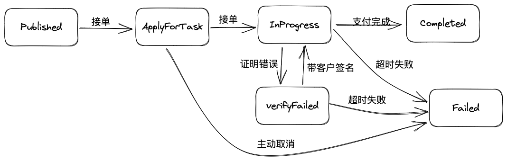
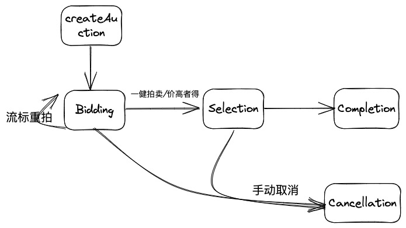
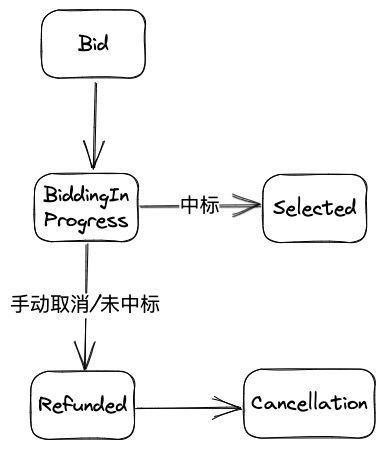

# Data Deals

## 公共功能合约

### DataTransaction合约

数据交易公共接口约束数据交易基本操作，供各交易类型继承使用，以下为其接口及属性相关定义。

每个交易以uint256类型作为ID,合约中设计一个计数器记录所有交易总数
计算交易状态设计：交易发布公示、交易承接、交易进行中、交易争议、交易失败、交易完成
计算交易定义，包含信息：交易ID、客户、承接人、交易状态、交易最大时长


#### DataTransaction状态图


#### DataTransaction属性定义
```
// 定义交易状态
enum TransactionState { Published, ApplyForTask, InProgress, ProcessDispute, Failed, Completed }

// 定义交易结构
struct Transaction {
    uint256 transactionId;         // 交易ID
    uint256 maxDuration;           // 交易最大时长 
    uint256 maxDisputeDuration;    // 最大争议处理时间
    address provider;              // 提供者
    string transcationType;        //交易类型
}

uint256 public totalTransactions;

// 存储所有交易信息
mapping(uint256 => Transaction) public transactions;

// 交易客户 
mapping(uint256 => address) public clients;

// 用于检查交易是否存在
mapping(uint256 => bool) public transactionExists;

// 存储交易状态
mapping(uint256 => TransactionState) public transactionStatus;
```
#### DataTransaction方法

```
// 事件：交易发布
event TransactionPublished(uint256 indexed transactionId, address indexed client);

// 事件：交易状态变更
event TransactionStatusChanged(uint256 indexed transactionId, uint256 newStatus);

constructor() {
    totalTransactions = 0;
}

// 修饰器：验证交易是否存在
modifier transactionExistsModifier(uint256 transactionId) {
    require(transactionExists[transactionId], "Transaction does not exist");
    _;
}

// 修饰器：只能由客户调用
modifier onlyClient(uint256 transactionId) {
    require(clients[transactionId] == msg.sender, "Only client can perform this action");
    _;
}

// 修饰器：只能由计算提供者调用
modifier onlyProvider(uint256 transactionId) {
    require(transactions[transactionId].provider == msg.sender, "Only provider can perform this action");
    _;
}

// 发布计算交易
function createTransaction(
    address _provider,
    uint256 _maxDuration,
    uint256 _maxDisputeDuration,
    string memory _transcationType 
) external {
    transactions[totalTransactions] = Transaction(
        totalTransactions ,
        _maxDuration,
        _maxDisputeDuration,
        _provider,
        _transcationType
    );

    transactionStatus[totalTransactions] = TransactionState.Published;

    transactionExists[totalTransactions] = true;

    totalTransactions++;

    emit TransactionPublished(totalTransactions, msg.sender);
}

// 改变交易状态，只允许内部调用
function updateState(uint256 transactionID, uint256 newStatus) internal {
    require(newStatus > uint256(TransactionState.Completed), "Invalid status"); // 确保状态值有效
    transactionStatus[transactionID] = TransactionState(newStatus);
    emit TransactionStatusChanged(transactionID, newStatus);
}

// 获取交易的状态
function getState(uint256 transcationID) external view returns (TransactionState) {
    return transactionStatus[transcationID];
}

// 获取交易客户
function getTransactionClient(uint256 transactionID) external view returns (address) {
    return clients[transactionID];
}

// 设置交易客户
function setTransactionClient(uint256 transactionID,address client) external onlyProvider(transactionID){
    clients[transactionID] = client;
    updateState(transactionID, uint256(TransactionState.ApplyForTask));
}
```
### Supervision合约（库）

数据交易币质押支付相关功能由Supervision合约实现，以下为其接口及属性相关定义。

#### Supervision方法

- 质押（pledge）
- 付款（successfulTransactionPaid）
- 退款（unsuccessfulTransactionRefunded）

#### Supervision属性

- 质押总量（totalPledgeAmount）

```solidity
uint256 public totalPledgeAmount;
```

## Storage Deal

数据集撮合拍卖功能由Auction合约和Bid合约实现，数据集管理功能由存储合约实现，存储交易管理功能由StorageTransaction合约实现，以下为各合约接口及属性相关定义。

### 存储合约

#### 属性定义

```solidity
//副本定义
struct Replica {
    uint256 ID; // 副本ID
    uint256 expiration;    // 有效期
    uint256 datacapMinPriceUnit; // 单个Piece最低价格
    uint256 datacapMaxPriceUnit; // 单个Piece直接成交价格
    string[] spLocation;     // 副本存储区域要求
    uint256 spBandwidth;   // 副本存储带宽要求
    uint256 spReputation;   // 最小信誉值
}

//副本状态
enum ReplicaState { Storing, Active, Inactive }

//副本当前存储状态
struct ReplicaStorageStatus{
    address clientAddress;     // 副本client账号
    address spAddress;     // 副本存储账号
    string spLocation;     // 副本存储区域要求
    ReplicaState  status;           // 存储进行中，存储有效，存储失效
}

//数据集切片
struct DatasetSlice {
    uint256 sliceId;
    uint256 startHashNumber;
    uint256 endHashNumber;
}

//数据集存储信息
struct DatasetStorageInfo {
    DatasetSlice[] slices
    uint256 counter;
    //数据集切片ID=>Replica[]
    maping(uint256 => Replica[])
    //replicaID=>ReplicaStatus
    maping(uint256 => ReplicaStatus)
}

//数据集ID => DatasetStorageInfo
maping(uint256 => DatasetStorageInfo)

uint256 public defautMinPrice; //默认每个piece最低价格
uint256 public defautMaxPrice; //默认每个piece直接成交价格
uint256 public defautLocationsPerReplica; // 默认数据集切片最少要在多少个区域进行存储
uint256 public defautBandwidth; // 默认带宽要求
uint256 public defautExpiration; // 默认存储时间
uint256 public defaultReputation;   // 默认最小信誉值

```

#### 存储合约方法

- 创建副本：监听链上数据集发布事件，创建副本，同时发布副本交易拍卖订单。
- 更新副本状态：更新SP地址，有效期，更新存储状态为有效（完成拍卖及存储交易后）。
- 续期：完成续期后，更新副本有效期。

### Auction合约

拍卖状态流程如下



竞标状态流程如下



#### Auction属性

```solidity
struct AuctionItem {
    string dataDescription; // 拍卖说明
    uint256 ID;             // ID
    uint256 replicaID;     // 副本ID
    uint256 AuctionMinPrice; // 拍卖最低价格
    uint256 AuctionMaxPrice; // 拍卖直接成交价格
    uint256 maxDuration; // 拍卖最大时长
}

// Auction状态
struct AuctionStatus{
    address BidAddress; // 中标人
    uint256 BidPrice;   // 中标价格
    AuctionState  status;
}

enum AuctionState { 
    Bidding, // 投标中
    Selection, // 选中
    Cancellation, // 取消
    Completion // 完成
}
```

#### Auction方法

- 创建拍卖（createAuction），根据数据属性创建智能合约拍卖单，拍卖单状态为投标中。
- 取消拍卖（cancelAuction），取消指定拍卖单，退款等清理操作完成后，状态置为取消。
- 一键拍卖（oneClickAuction），出价代币质押到监管合约；完成其它已投标质押退款后，状态置为完成状态。
- 结束投标（endBidding），拍卖最大时长到期后，触发结束投标操作，使用默认选择策略（价高者），将状态置为标的选中；如果拍卖周期内未收到投标时，重置拍卖最大时长发起下一轮投标，拍卖单状态为投标中。
- 结束拍卖（endAuction），拍卖完成，完成其它未中标质押退款，状态置为完成状态。

//拍卖ID => Bid[]  
maping(uint256 => Bid[])

#### Bid属性

```solidity
struct Bid {
    uint256 bidAmount; // 投标金额
    uint256 bidTime;   // 投标时间
    BidStatus bidStatus; // 投标状态
}

// Bid状态
enum BidStatus { 
    BiddingInProgress, // 投标中
    Selected,          // 中标
    Refunded,          // 已退款
    Cancellation       // 取消
}
```

#### Bid方法

- 出价（placeBid），在拍卖单投标周期内，调用出价接口出价竞拍，状态置为投标中。
- 中标（selected），出价代币质押到监管合约，状态置为中标。
- 取消（cancellation），取消出价竞拍，或未中标取消，出价代币从监管合约退款。状态置为已退款，完成所有取消工作后，状态置为取消。

### StorageTransaction合约

#### 合约实现

继承ADataTransaction合约重写校验接口

### 存储校验算法实现

存储校验算法处理流程


Proof包含：dealID, clientAddress, CID
校验算法：比较链上dealID对应的clientAddress, CID，与Proof包含的是否一致。

## Retrieve Deal

检索交易中，数据集下载交易功能由RetrieveTransaction合约实现，数据集检索查找功能由前端业务层实现，以下为合约接口及属性相关定义。

### RetrieveTransaction合约
#### 合约实现
继承ADataTransaction合约重写校验接口

#### RetrieveTransaction校验接口实现

提供链下证明生成及校验工具，

## Compute Deal
计算交易中，交易功能由ComputeTransaction合约实现，以下为合约接口及属性相关定义。

### 计算交易合约

#### 合约实现
继承DataTransaction合约重写校验接口

#### 计算交易校验算法

