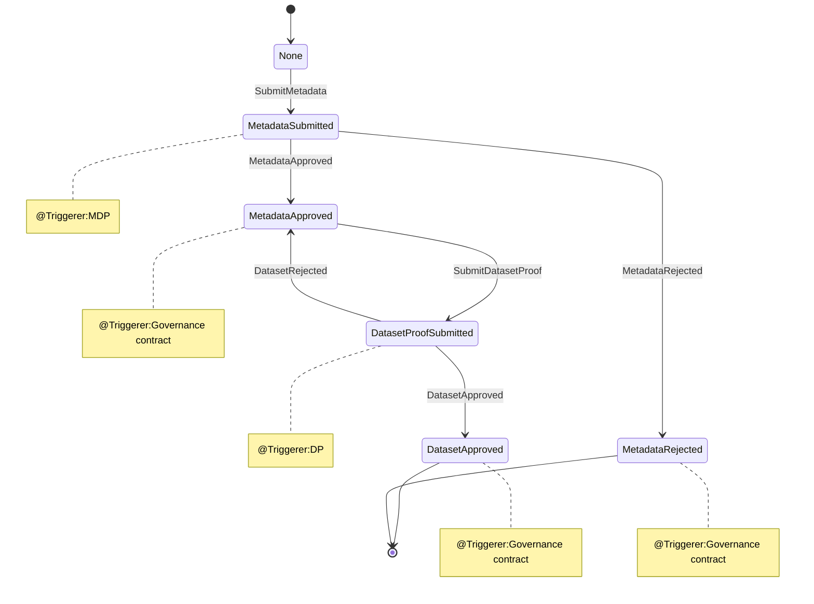

## Dataset

### 1 Concepts
Dataset is a crucial component of TrustlessNotary within FilPlus. Its main role is to audit datasets from web2, including verifying dataset metadata and validating source data proofs. Only datasets approved by Dataswap can proceed to the next transaction step within DataSwap, automatically allocating datacap and storing them on the web3 network.

Initiating approval or rejection requests for datasets can only originate from the Dataswap governance contract.

### 2 Types
```js
/// @notice Struct representing metadata associated with a dataset.
struct Metadata {
    string title; // Title of the dataset.
    string industry; // Industry category of the dataset.
    string name; // Name of the dataset.
    string description; // Description of the dataset.
    string source; // Source of the dataset.
    string accessMethod; // Method of accessing the dataset (e.g., URL, API).
    address submitter; // Address of the dataset's submitter.
    uint64 createdBlockNumber; // Block number at which the dataset was created.
    uint64 sizeInBytes; // Size of the dataset in bytes.
    bool isPublic; // Boolean indicating if the dataset is public.
    uint64 version; // Version number of the dataset.
}

/// @notice Enum representing the possible states of a dataset.
enum State {
    None, // No specific state.
    MetadataSubmitted, // Metadata submitted but not approved.
    MetadataApproved, // Metadata has been approved.
    MetadataRejected, // Metadata submission has been rejected.
    DatasetProofSubmitted, // Proof of dataset submitted.
    DatasetApproved // Dataset has been approved.
}

/// @notice Enum representing the events related to dataset management.
enum Event {
    SubmitMetadata, // Metadata submission event.
    MetadataApproved, // Metadata approval event.
    MetadataRejected, // Metadata rejection event.
    SubmitDatasetProof, // Dataset proof submission event.
    DatasetApproved, // Dataset approval event.
    DatasetRejected // Dataset rejection event.
}

/// @notice Enum representing the type of data associated with a matching.
enum DataType {
    Source, // Matching is associated with a dataset
    MappingFiles // Matching is associated with mapping files
}

/// @notice Struct representing proofs associated with a dataset challenge submitted by reviewers.
struct DatasetProof {
    uint64 datasetSize;
    bytes32 rootHash; // Root hash of the data's Merkle tree.
    bool allCompleted; // check if batch submit completed
    uint64 leafHashesCount;// leaf hashes of thedata's Merkle tree. 
    bytes32[] leafHashes; // Proof associated with the dataset.
}

/// @notice Struct representing proofs associated with a dataset challenge submitted by reviewers.
struct DatasetChallengeProof {
    bytes32[] siblings;
    uint32 path;
}

/// @notice Struct representing verification details of a dataset.
struct Verification {
    uint64 randomSeed; // Random seed used for verification. This seed determines which nodes need to be challenged.
    DatasetChallengeProof[] challengeProof; // Merkle proof provided by the auditor to support their challenge.
}

/// @notice Struct representing a dataset including its metadata, state, proof, and verifications.
struct Dataset {
    Metadata metadata; // Metadata of the dataset.
    State state; // Current state of the dataset.
    //proof
    string mappingFilesAccessMethod; // Method of accessing data (e.g., URL, API).
    DatasetProof sourceProof; // Proof associated with the dataset.
    DatasetProof mappingFilesProof; // Proof associated with the dataset.
    //verifications
    uint16 verificationsCount;
    mapping(address => Verification) verifications; // Address of the auditor who submits challenges.
}
```

### 3 State Variabless
```js
uint64 public datasetsCount; // Total count of datasets
mapping(uint64 => DatasetType.Dataset) private datasets; // Mapping of dataset ID to dataset details
```

### 4 State machine


### 5 Interface
```js
interface IDatasets {
    ///@notice Approve a dataset.
    ///@dev This function changes the state of the dataset to DatasetApproved and emits the DatasetApproved event.
    function approveDataset(uint64 _datasetId) external;

    ///@notice Approve the metadata of a dataset.
    ///@dev This function changes the state of the dataset to MetadataApproved and emits the MetadataApproved event.
    function approveDatasetMetadata(uint64 _datasetId) external;

    ///@notice Reject a dataset.
    ///@dev This function changes the state of the dataset to DatasetRejected and emits the DatasetRejected event.
    function rejectDataset(uint64 _datasetId) external;

    ///@notice Reject the metadata of a dataset.
    ///@dev This function changes the state of the dataset to MetadataRejected and emits the MetadataRejected event.
    function rejectDatasetMetadata(uint64 _datasetId) external;

    ///@notice Submit metadata for a dataset
    ///        Note:anyone can submit dataset metadata
    function submitDatasetMetadata(
        string memory _title,
        string memory _industry,
        string memory _name,
        string memory _description,
        string memory _source,
        string memory _accessMethod,
        uint64 _sizeInBytes,
        bool _isPublic,
        uint64 _version
    ) external;

    ///@notice Submit proof for a dataset
    function submitDatasetProofBatch(
        uint64 _datasetId,
        DatasetType.DataType _dataType,
        string calldata accessMethod,
        bytes32 _rootHash,
        bytes32[] calldata _leafHashes,
        uint64[] calldata _leafSizes,
        bool _completed
    ) external;

    ///@notice Submit proof for a dataset
    function submitDatasetVerification(
        uint64 _datasetId,
        uint64 _randomSeed,
        bytes32[][] memory _siblings,
        uint32[] memory _paths
    ) external;

    ///@notice Get dataset metadata
    function getDatasetMetadata(
        uint64 _datasetId
    )
        external
        view
        returns (
            string memory title,
            string memory industry,
            string memory name,
            string memory description,
            string memory source,
            string memory accessMethod,
            address submitter,
            uint64 createdBlockNumber,
            uint64 sizeInBytes,
            bool isPublic,
            uint64 version
        );

    ///@notice Get dataset source CIDs
    function getDatasetProof(
        uint64 _datasetId,
        DatasetType.DataType _dataType,
        uint64 _index,
        uint64 _len
    ) external view returns (bytes32[] memory);

    ///@notice Get dataset source CIDs
    function getDatasetCars(
        uint64 _datasetId,
        DatasetType.DataType _dataType,
        uint64 _index,
        uint64 _len
    ) external view returns (bytes32[] memory);

    function getDatasetProofCount(
        uint64 _datasetId,
        DatasetType.DataType _dataType
    ) external view returns (uint64);

    ///@notice Get dataset source CIDs
    function getDatasetCarsCount(
        uint64 _datasetId,
        DatasetType.DataType _dataType
    ) external view returns (uint64);

    ///@notice Get dataset size
    function getDatasetSize(
        uint64 _datasetId,
        DatasetType.DataType _dataType
    ) external view returns (uint64);

    ///@notice Get dataset state
    function getDatasetState(
        uint64 _datasetId
    ) external view returns (DatasetType.State);

    ///@notice Get dataset verification
    function getDatasetVerification(
        uint64 _datasetId,
        address _auditor
    )
        external
        view
        returns (bytes32[][] memory _siblings, uint32[] memory _paths);

    ///@notice Get count of dataset verifications
    function getDatasetVerificationsCount(
        uint64 _datasetId
    ) external view returns (uint16);

    ///@notice Check if a dataset has metadata
    function hasDatasetMetadata(
        string memory _accessMethod
    ) external view returns (bool);

    ///@notice Check if a dataset has a cid
    function isDatasetContainsCar(
        uint64 _datasetId,
        bytes32 _cid
    ) external returns (bool);

    ///@notice Check if a dataset has cids
    function isDatasetContainsCars(
        uint64 _datasetId,
        bytes32[] memory _cids
    ) external view returns (bool);

    // Default getter functions for public variables
    function datasetsCount() external view returns (uint64);
}
```


[return to the system page](../../README.md#232-module-layeryou-can-consider-it-as-the-domain-layer)
