## Matching

### 1 Concepts
In Dataswap, only approved datasets can participate in the matching process, which involves pairing the dataset with a collection of cars within the Dataswap platform. The target of this matching process is the set of cars contained within the approved dataset.

Key features of the matching process include:
- Auction Support: Dataswap provides functionality for conducting auctions as part of the matching process.
- Tender Support: Dataswap supports tender mechanisms for matching datasets and car collections.
- One-Click Deal: Dataswap offers the convenience of a one-click deal option for efficient matching.

### 2 Types
```js
/// @notice Enum representing the possible states of a dataset matching.
enum State {
    None,
    Published, // Matching is published and open for bids
    InProgress, // Matching is currently in progress
    Paused, // Matching is paused
    Closed, // Matching is closed and no longer accepting bids
    Completed, // Matching is completed
    Cancelled, // Matching is cancelled
    Failed // Matching has failed
}

/// @notice Enum representing the events associated with dataset matching.
enum Event {
    Publish, // Matching is published
    FilPlusCheckSuccessed, // Fil+ check succeeded
    FilPlusCheckFailed, // Fil+ check failed
    Pause, // Matching is paused
    PauseExpired, // Pause period expired
    Resume, // Matching is resumed
    Cancel, // Matching is cancelled
    Close, // Matching is closed
    HasWinner, // Matching has a winner
    NoWinner // No winner in the matching
}

/// @notice Enum representing the rules for determining the winning bid.
enum BidSelectionRule {
    HighestBid, // Note: Auction, Winner is determined by the highest bid
    LowestBid, // Note: Tender, Winner is determined by the lowest bid
    ImmediateAtLeast, // Note: Auction Immediate winning condition: Bid amount is at least the threshold
    ImmediateAtMost // Note: Render Immediate winning condition: Bid amount is at most the threshold
}

/// @notice Enum representing the type of data associated with a matching.
enum DataType {
    Source, // Matching is associated with a dataset
    MappingFiles // Matching is associated with mapping files
}

/// @notice Struct representing the target of a matching.
/// @dev TODO: support batch submit likes DatasetProof of dataset
struct Target {
    uint64 datasetId; // ID of the dataset associated with the matching
    bytes32[] cars; // Array of car IDs associated with the matching
    uint64 size; // Size of the matching target，Note:total datacap size that this matching need allocate
    DataType dataType; // Type of data associated with the matching
    uint64 associatedMappingFilesMatchingID; // ID of the matching associated with mapping files
}

/// @notice Struct representing a bid in a matching.
struct Bid {
    address bidder; // Address of the bidder
    uint256 bid; // Bid amount
}

/// @notice Struct representing a dataset matching.
struct Matching {
    Target target; // Matching target details
    BidSelectionRule bidSelectionRule;
    uint64 biddingDelayBlockCount; // Number of blocks to delay bidding
    uint64 biddingPeriodBlockCount; // Number of blocks for bidding period
    uint64 storagePeriodBlockCount; // Number of blocks for storage period,, representing the duration of the storage completion time period.
    uint256 biddingThreshold; // Threshold for bidding
    string additionalInfo; // Additional information about the matching
    address initiator; // Address of the initiator of the matching
    uint64 createdBlockNumber; // Block number at which the matching was created
    State state; // Current state of the matching
    Bid[] bids; // Array of bids in the matching
    address winner; // Address of the winner in the matching
}
```
### 3 State Variabless
```js
uint64 public matchingsCount;
mapping(uint64 => MatchingType.Matching) private matchings;
```

### 4 State machine

```mermaid
stateDiagram
    [*]          --> None 
    None         --> Published:Publish
    Published    --> InProgress:FilPlusCheckSuccessed
    Published    --> Failed:FilPlusCheckFailed
    InProgress   --> Paused:Pause
    Paused       --> InProgress:Resume
    Paused       --> Failed:PauseExpired
    Published    --> Cancelled:Cancel
    InProgress   --> Cancelled:Cancel
    Paused       --> Cancelled:Cancel
    InProgress   --> Closed:Condition_Expired
    Closed       --> Failed:NoWinner
    Closed       --> Completed:HasWinner
    Completed    --> [*]
    Failed       --> [*]
    Cancelled    --> [*] 

    note right of Published
      @Auction Triggerer:DP
      @Tender Triggerer:SP
      @Auction/Tender item: a copy of dataset partition
      @Condition: 1 dataset is DataApprove;2 If you intend to publish an order for the source data of a dataset, it is essential that the mappingFiles data associated with that dataset has been successfully matched and stored on the Filecoin network.
    end note
    note right of Paused
      @Auction Triggerer:DP
      @Tender Triggerer:SP
    end note
    note right of Cancelled 
      @Auction Triggerer:DP
      @Tender Triggerer:SP
    end note
    note right of Closed
      @Triggerer:anyone
    end note
```


### 5 Interface
```js
interface IMatchings {
    /// @notice  Function for bidding on a matching
    function bidding(uint64 _matchingId, uint256 _amount) external;

    function publishMatching(
        uint64 _datasetId,
        bytes32[] memory _cars,
        uint64 _size,
        MatchingType.DataType _dataType,
        uint64 _associatedMappingFilesMatchingID,
        MatchingType.BidSelectionRule _bidSelectionRule,
        uint64 _biddingDelayBlockCount,
        uint64 _biddingPeriodBlockCount,
        uint64 _storagePeriodBlockCount,
        uint256 _biddingThreshold,
        string memory _additionalInfo
    ) external;

    /// @notice  Function for pausing a matching
    function pauseMatching(uint64 _matchingId) external;

    /// @notice Function for reporting that a matching pause has expired
    function reportMatchingPauseExpired(uint64 _matchingId) external;

    /// @notice  Function for resuming a paused matching
    function resumeMatching(uint64 _matchingId) external;

    /// @notice  Function for canceling a matching
    function cancelMatching(uint64 _matchingId) external;

    /// @notice  Function for closing a matching and choosing a winner
    function closeMatching(uint64 _matchingId) external;

    /// @notice  Function for getting bids in a matching
    function getMatchingBids(
        uint64 _matchingId
    ) external view returns (address[] memory, uint256[] memory);

    /// @notice  Function for getting bid amount of a bidder in a matching
    function getMatchingBidAmount(
        uint64 _matchingId,
        address _bidder
    ) external view returns (uint256);

    /// @notice  Function for getting the count of bids in a matching
    function getMatchingBidsCount(
        uint64 _matchingId
    ) external view returns (uint64);

    /// @notice  Function for getting the count of bids in a matching
    function getMatchingCars(
        uint64 _matchingId
    ) external view returns (bytes32[] memory);

    function getMatchingCapacity(
        uint64 _matchingId
    ) external view returns (uint64);

    function getMatchingInitiator(
        uint64 _matchingId
    ) external view returns (address);

    /// @notice  Function for getting the state of a matching
    function getMatchingState(
        uint64 _matchingId
    ) external view returns (MatchingType.State);

    /// @notice Get the target information of a matching.
    /// @param _matchingId The ID of the matching.
    /// @return datasetID The ID of the associated dataset.
    /// @return cars An array of CIDs representing the cars in the matching.
    /// @return size The size of the matching.
    /// @return dataType The data type of the matching.
    /// @return associatedMappingFilesMatchingID The ID of the associated mapping files matching.
    function getMatchingTarget(
        uint64 _matchingId
    )
        external
        view
        returns (
            uint64 datasetID,
            bytes32[] memory cars,
            uint64 size,
            MatchingType.DataType dataType,
            uint64 associatedMappingFilesMatchingID
        );

    /// @notice  Function for checking if a bidder has a bid in a matching
    function hasMatchingBid(
        uint64 _matchingId,
        address _bidder
    ) external view returns (bool);

    /// @notice Check if a matching with the given matching ID contains a specific CID.
    /// @param _matchingId The ID of the matching to check.
    /// @param _cid The CID (Content Identifier) to check for.
    /// @return True if the matching contains the specified CID, otherwise false.
    function isMatchingContainsCar(
        uint64 _matchingId,
        bytes32 _cid
    ) external view returns (bool);

    /// @notice Check if a matching with the given matching ID contains multiple CIDs.
    /// @param _matchingId The ID of the matching to check.
    /// @param _cids An array of CIDs (Content Identifiers) to check for.
    /// @return True if the matching contains all the specified CIDs, otherwise false.
    function isMatchingContainsCars(
        uint64 _matchingId,
        bytes32[] memory _cids
    ) external view returns (bool);

    /// @notice check is matching targe valid
    function isMatchingTargetValid(
        uint64 _datasetId,
        bytes32[] memory _cars,
        uint64 _size,
        MatchingType.DataType _dataType,
        uint64 _associatedMappingFilesMatchingID
    ) external view returns (bool);

    /// @notice Check if a matching meets the requirements of Fil+.
    function isMatchingTargetMeetsFilPlusRequirements(
        uint64 _matchingId
    ) external view returns (bool);

    /// @notice Check if a matching meets the requirements of Fil+.
    function isMatchingTargetMeetsFilPlusRequirements(
        uint64 _datasetId,
        bytes32[] memory _cars,
        uint64 _size,
        MatchingType.DataType _dataType,
        uint64 _associatedMappingFilesMatchingID
    ) external view returns (bool);

    // Default getter functions for public variables
    function matchingsCount() external view returns (uint64);
}
```

[return to the system page](../../README.md)

